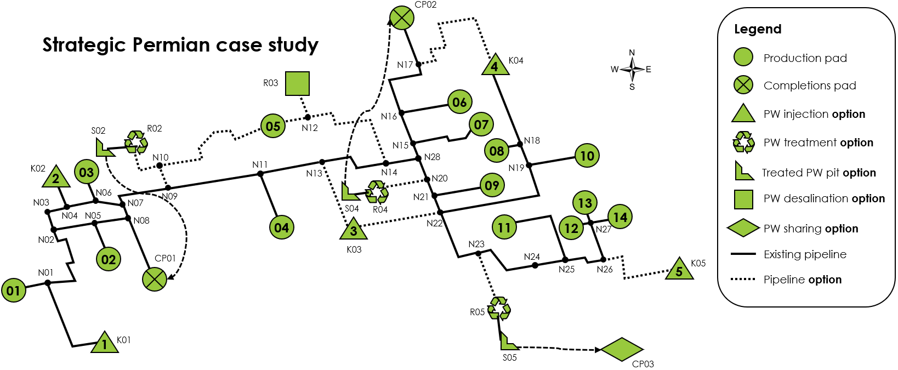

Case Studies
============

Network schematics
------------------

    Strategic Permian demo network.

    Strategic toy case study network.

    Strategic small case study network.

.. figure:: ../img/strategic_treatment_demo_network.png
    :width: 1000
    :align: center
    :alt: Strategic treatment demo network schematic

    Strategic treatment demo network.

    Strategic model network developed for use in PARETO workshops.

Comparison table
----------------
.. |br| raw:: html

   

.. list-table::
   :header-rows: 1

   * -
     - Strategic Permian demo
     - Strategic toy case study
     - Strategic small case study
     - Strategic treatment demo
     - Strategic surrogate demo
     - Strategic workshop baseline
     - Operational case study
   * - **Input file**
     - ``strategic_permian_demo.xlsx``
     - ``strategic_toy_case_study.xlsx``
     - ``strategic_small_case_study.xlsx``
     - ``strategic_treatment_demo.xlsx``
     - ``strategic_treatment_demo_surrogates.xlsx``
     - ``workshop_baseline_all_data.xlsx``
     - ``operational_generic_case_study.xlsx``
   * - **Model type**
     - Strategic
     - Strategic
     - Strategic
     - Strategic
     - Strategic
     - Strategic
     - Operational
   * - **Description**
     - A representative example of a |br|
       Permian system. Nearly identical |br|
       to treatment demo, but with |br|
       reduced CAPEX options.
     - A very small, toy-sized network. |br|
       Useful for testing and debugging.
     - Larger network, but "small" in the |br|
       sense that disposal and pipeline |br|
       expansion are not allowed, so the |br|
       model solves quickly.
     - Larger network, and disposal and |br|
       pipeline expansion are allowed. |br|
       Takes a bit longer to solve. This |br|
       can be seen as the "default" case |br|
       study for the strategic model.
     - Same as strategic treatment demo, |br|
       but allows for the option (but not |br|
       the requirement) to use surrogate |br|
       models for desalination sites (MD |br|
       and MVC).
     - Network developed for use in |br|
       PARETO workshops. Solves quickly.
     - Generic case study for the |br|
       operational model. Note that this |br|
       case study cannot currently be run |br|
       in PARETO UI - it can only be run |br|
       using the Python command line |br|
       interface.
   * - **Decision period**
     - Week
     - Week
     - Week
     - Week
     - Week
     - Week
     - Day
   * - **Decision horizon**
     - 52 weeks
     - 52 weeks
     - 52 weeks
     - 52 weeks
     - 52 weeks
     - 10 weeks
     - 5 days
   * - **Network nodes**
     - 28
     - 9
     - 28
     - 28
     - 28
     - 9
     - 0
   * - **Production pads**
     - 14
     - 4
     - 15
     - 14
     - 14
     - 4
     - 5
   * - **Production tanks**
     - N/A
     - N/A
     - N/A
     - N/A
     - N/A
     - N/A
     - 14
   * - **Completions pads**
     - 3
     - 1
     - 4
     - 3
     - 3
     - 2
     - 1
   * - **External completions pads** [#]_
     - 1 (CP03)
     - 0
     - 0
     - 1 (CP03)
     - 1 (CP03)
     - 1 (CP02)
     - N/A
   * - **Disposal sites (SWD)**
     - 5
     - 2
     - 3
     - 5
     - 5
     - 2
     - 2
   * - **Disposal expansion allowed?** [#]_
     - Yes, for K03 and K05
     - No
     - No
     - Yes, for K03 and K05
     - Yes, for K03 and K05
     - No
     - No
   * - **Storage sites**
     - 3
     - 3
     - 2
     - 3
     - 3
     - 3 |br|
       Only one storage site (S02) is shown |br|
       in the above schematic and used in |br|
       the workshop baseline scenario. Two |br|
       additional storage sites (S03 and S04) |br|
       are unused in the baseline scenario, |br|
       but are included in the input file so |br|
       they can used in the beneficial reuse |br|
       scenario (which builds off of the |br|
       baseline scenario).
     - 0
   * - **Storage expansion allowed?**
     - Yes
     - Yes
     - No
     - Yes
     - Yes
     - Yes
     - No
   * - **Completions pad storage?**
     - No
     - No
     - Yes
     - No
     - No
     - No
     - Yes
   * - **Treatment sites**
     - 4 |br|
       Non-desalination sites: R02, R04, R05 |br|
       Desalination sites: R03 |br|
       All sites have zero initial treatment |br|
       capacity
     - 2 |br|
       Non-desalination site: R02 |br|
       Desalination site: R01 |br|
       Both sites have zero initial |br|
       treatment capacity
     - 2 |br|
       Both are non-desalination sites |br|
       Both sites have nonzero initial |br|
       treatment capcity
     - 6 |br|
       Non-desalination sites: R02, R04, R05 |br|
       Desalination sites: R01, R03, R06 |br|
       All sites have zero initial treatment |br|
       capacity
     - 6 |br|
       Non-desalination sites: R02, R04, R05 |br|
       Desalination sites: R01, R03, R06 |br|
       All sites have zero initial treatment |br|
       capacity
     - 2 |br|
       Non-desalination site: R02 |br|
       Desalination site: R01 |br|
       Both sites have zero initial |br|
       treatment capacity
     - 2
   * - **Treatment technologies**
     - Non-desalination: CB, CB-EV |br|
       Desalination: FF
     - Non-desalination: CB, CB-EV |br|
       Desalination: MVC, MD, OARO
     - Non-desalination: CB
     - Non-desalination: CB, CB-EV |br|
       Desalination: FF, HDH
     - Non-desalination: CB, CB-EV |br|
       Desalination (simple): FF, HDH |br|
       Desalination (surrogate): MVC, MD
     - Non-desalination: CB, CB-EV |br|
       Desalination: MVC, MD
     - N/A
   * - **Treatment expansion allowed?**
     - Yes
     - Yes
     - Yes (but only one capacity option)
     - Yes
     - Yes
     - Yes
     - No
   * - **Pipeline expansion allowed?**
     - Yes
     - Yes
     - No
     - Yes
     - Yes
     - Yes
     - No
   * - **Hydraulics settings**
     - Roughness factor: 110 |br|
       Head loss: 0.03
     - Roughness factor: 110 |br|
       Head loss: 0.03
     - Roughness factor: 110 |br|
       Head loss: 0.03
     - Roughness factor: 110 |br|
       Head loss: 0.03
     - Roughness factor: 110 |br|
       Head loss: 0.03
     - Roughness factor: 110 |br|
       Head loss: 0.03
     - N/A
   * - **Economics**
     - Discount rate: 8% |br|
       CAPEX lifetime: 20 years
     - Discount rate: 8% |br|
       CAPEX lifetime: 20 years
     - Discount rate: 8% |br|
       CAPEX lifetime: 20 years
     - Discount rate: 8% |br|
       CAPEX lifetime: 20 years
     - Discount rate: 8% |br|
       CAPEX lifetime: 20 years
     - Discount rate: 8% |br|
       CAPEX lifetime: 20 years
     - N/A
   * - **Notes**
     - Recommend solving with Gurobi, |br|
       or with >15min runtime with CBC. |br|
     -
     -
     - Recommend solving with Gurobi.
     - Recommend solving with Gurobi.
     -
     -

.. [#] In the strategic model, external completions pads can be used to model opportunities for water sharing outside of the main network.
.. [#] In the strategic model, disposal capacity expansion is only allowed for SWD sites for which the initial disposal capacity is 0.

Abbreviations
^^^^^^^^^^^^^

* CB: Clean brine treatment
* CB-EV: Clean brine treatment with enhanced evaporation
* FF: Falling film evaporation
* HDH: Humidification-dehumidification
* MD: Membrane distillation
* MVC: Mechanical vapor compression
* OARO: Osmotically assisted reverse osmosis
* SWD: Salt water disposal
