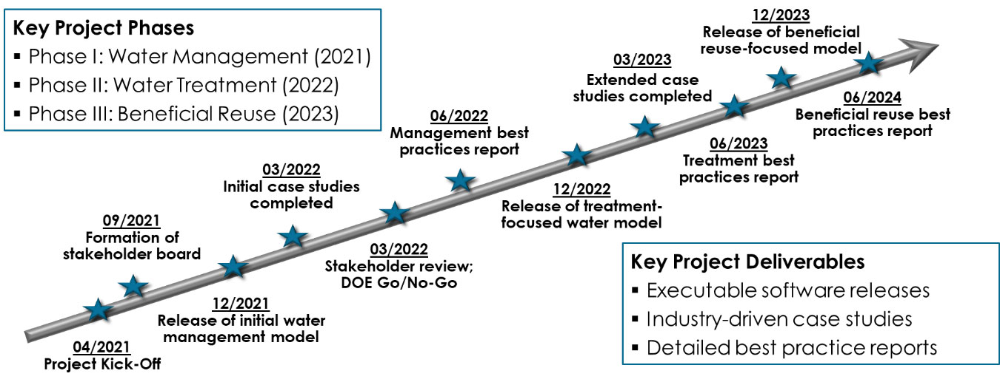

.. index::
    pair: pareto;Home

Produced Water Application for Beneficial Reuse, Environmental Impact and Treatment Optimization (PARETO)
=========================================================================================================

Project Goals
-------------
The goal of the project is to develop a modeling and optimization application,
PARETO, that can help organizations better manage, better treat, and – where possible – beneficially reuse produced water from oil and gas operations.
Specifically, PARETO will help decision-makers with:

* buildout of the produced water infrastructure
* management of produced water volumes
* selection of effective treatment technologies
* placement & sizing of treatment facilities
* identification of beneficial water reuse options
* distribution of treated produced water for reuse

The initiative is committed to viewing produced water management from a “systems” perspective and to building an inclusive framework that will unite stakeholders from across the produced water community. The vision is that PARETO will not only help oil & gas but also allow other industries (e.g., agriculture, mining) explore beneficial reuse opportunities for treated produced water. Figure 1 (below) illustrates the scope of “Project PARETO”.

Collaborating institutions
--------------------------
The PARETO team is comprised of collaborators from the following institutions:

* National Energy Technology Laboratory (Lead)
* Sandia National Laboratory
* Lawrence Berkeley National Laboratory

Project Timeline
----------------

Project PARETO is a 3-year initiative that has been split into three distinct phases; with each phase taking up exactly one year. In execution year 2021, PARETO will capture produced water management, i.e., capturing options for coordinating water deliveries in a given development area. By execution year 2022, the project will shift its attention towards produced water treatment. Finally, execution year 2023 will be dedicated to produced water beneficial reuse.

    Figure 4. Project PARETO Timeline

In terms of deliverables, PARETO itself will be released as free and open-source software every year of the initiative – with increasing capabilities and functionality becoming available over time. The project team is also committed to conducting case studies with industrial and other partners; and where possible findings from those collaborations will be shared with the produced water community as best practice reports.
It should also be noted that the project will be continuously evaluated by a comprehensive stakeholder board that involves individuals representing upstream operators, midstream organizations, treatment technology providers, beneficial reuse entities, regulatory agencies and others – all of which will guide the project team and provide necessary input.

Contact us
-----------
General, background and overview information is available at the `PARETO main
website <https://www.project-pareto.org/>`_.  Framework development happens at our `GitHub
repo <https://github.com/project-pareto/project-pareto>`_ where you can `report issues/bugs
<https://github.com/project-pareto/project-pareto/issues>`_ or `make contributions
<https://github.com/project-pareto/project-pareto/pulls>`_.  For further enquiries, send an
email to |support-email|.

Contents
--------

.. toctree::
    :maxdepth: 2

    getting_started/index
    model_library/index
    case_studies/index
    tutorials_examples/index
    utilities/index
    faq
    citing
    license
    copyright

Indices and tables
==================

* :ref:`genindex`
