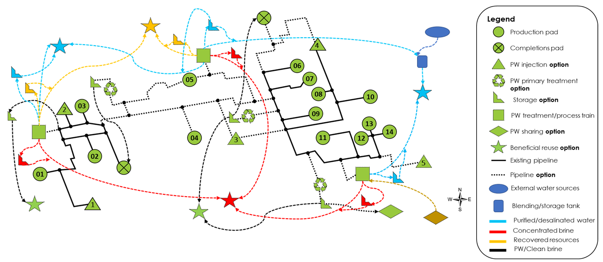

Beneficial Reuse
================

.. note:: Please be advised that the beneficial reuse feature within the PARETO tool is currently under development. As such, the content and functionalities discussed within this document may be subject to changes or updates.

.. note:: The examples of beneficial reuse options and their related details (costs, pricing, and quality) provided in this document are for illustrative purposes only. They should not be taken as precise or accurate reflections of real-world scenarios. Rather, they are intended to serve as initial reference points for users exploring the beneficial reuse functionalities of the PARETO tool.

Overview
========
Produced water from oil and gas operations has long posed management challenges, particularly as traditional disposal methods come under scrutiny due to environmental and seismicity concerns. Beneficial reuse of produced water has emerged as a viable solution, offering environmental benefits in regions with high water stress and potential cost offsets from resource recovery. The PARETO tool is pioneering in this space, with its ability to optimize beneficial reuse options within a produced water network, providing a practical and efficient platform for stakeholders to navigate this emerging and important topic.

Table of Contents
=================
+--------------------------------------------------------+
| Section                                                |
+========================================================+
| :ref:`beneficial_reuse_model_in_pareto`                |
+--------------------------------------------------------+
| :ref:`modeling_considerations`                         |
+--------------------------------------------------------+
| :ref:`beneficial_reuse_feature_inputs_and_outputs`     |
+--------------------------------------------------------+
| :ref:`examples_of_beneficial_reuse_options`            |
+--------------------------------------------------------+

.. _beneficial_reuse_model_in_pareto:

Beneficial Reuse Model in PARETO
================================
In the PARETO tool, beneficial reuse is represented as a unique kind of demand node (:math:`o \in O`). These nodes receive streams from various other nodes in the network, which include treatment or process sites, production sites, or storage sites. The distinct characteristic of these beneficial reuse nodes, which sets them apart from the rest of the produced water network, is their ability to accommodate various materials based on specific reuse requirements.

Rather than handling only produced water or clean brine of various qualities, beneficial reuse nodes can accept a diverse array of streams. These might include untreated produced water, clean brine, desalinated water, and concentrated brine, as well as recovered resources in different material states—gas, liquid, or solid. 

.. math::

    \sum_{l \in L | (l, o) \in LOA \cup LOT}F_{l,o,t} = F_{o,t}

.. math::

    \sum_{l \in L | (l, o) \in LOA \cup LOT} F_{l,o,t} \cdot Q_{l,qc,t} = Q_{o,qc,t} \cdot F_{o,t}

.. math::

   LOA = \\{(l, o) \in LLA \ | \ o \in O\\}

.. math::

   LRT = \\{(l, o) \in LLT \ | \ o \in O\\}

where :math:`F` and :math:`Q` denotes the flow and quality (concentrations) of streams. The units of concentration are typically reported as mass/volume (mg/L, g/m\ :sup:`3`, kg/L, etc.) and the units of flow rate are reported in volume/time (e.g. bbl/week).

Figure 1 presents a schematic of a typical produced water network featuring multiple beneficial reuse options. In this figure, each star designates a specific beneficial reuse site, with distinct colors indicating the type of material received at each site. Notably, the storage units and connecting arcs share the same color as their corresponding beneficial reuse sites, emphasizing that they are material-specific to each beneficial reuse option.

    Figure 1. produced water beneficial reuse network schematic

.. _modeling_considerations:

Modeling Considerations
=======================
Modeling the beneficial reuse of produced water within PARETO requires a nuanced approach, accounting for various challenges specific to each reuse scenario. The following considerations are particularly noteworthy:

**Dynamics of Supply and Demand:**

- **Demand Commitments:** 
    Each beneficial reuse node will have specific demand commitments, which must be fulfilled by the produced water network.

- **Seasonal Variations:** 
    Demand may fluctuate seasonally, with downstream nodes requiring more or less water during different parts of the year. 

**Treatment/Process Unit Locations:**

- **Centralized vs. Distributed Plants:** 
    A centralized plant serving multiple reuse locations can benefit from economies of scale, while distributed plants may entail higher costs but lower transportation expenses.

- **Quality Requirements:** 
    The material quality requirements of each reuse option dictate the treatment train requirements, including costs associated with pre-treatment and post-treatment processes.

- **Mixing with Other Sources:** 
    It may be necessary to consider the option of mixing with other sources to meet quality and quantity requirements.

**Meeting Higher-Level Targets:**

- These might include national or global goals to enhance process efficiency or achieve a specific benchmark.

**Risk Consideration:**

- Risks associated with each beneficial reuse option can range from data uncertainty to availability constraints affecting the reception of water.

**Cost-Benefit Analysis:**

- Each beneficial reuse option carries tangible and intangible costs and benefits that must be accounted for in the model.

By carefully considering these factors, PARETO can provide a more accurate, realistic, and nuanced model for the beneficial reuse of produced water.

.. _beneficial_reuse_feature_inputs_and_outputs:

Beneficial Reuse Feature: Inputs and Outputs
============================================
The Beneficial Reuse feature within PARETO extensively depends on the dynamic interplay of supply and demand, coupled with the economic parameters associated with each reuse option. Therefore, the feature inputs have been curated to cover a comprehensive range of economic inputs:

- Material-specific unit cost of transportation
- Material-specific unit cost of storage
- Material-specific unit cost of production
- Material-specific and beneficial reuse-specific unit profit/price or credit

The model imposes no limitation on the number of materials a user might choose to manage, offering the flexibility to handle various types of streams. Given these economic inputs and the dynamics of supply and demand, the model optimizes the network to yield the following outputs:

- Optimum beneficial reuse selection
- Optimum treatment/process technology selection
- Optimum location and capacity selection
- Optimum resource allocation among beneficial reuse options
- Optimum storage location and capacities

Additionally, the model facilitates sensitivity analysis, permitting examination of how the optimized network might vary with different resource market prices, technology costs, storage or transportation costs, or changes in any other economic input parameters. This empowers users to effectively compare and evaluate different scenarios.

.. _examples_of_beneficial_reuse_options:

Examples of Beneficial Reuse Options
====================================
Aquifer recharge and surface discharge
--------------------------------------------

Aquifer recharge and surface discharge are potential beneficial reuse options for treated produced water or wastewater. Aquifer recharge, a process where water seeps into an aquifer through recharge basins or injection wells, replenishes groundwater resources and also serves as a wastewater disposal method. The treated water must meet stringent guidelines for quality to ensure safety and usability. Specific standards for Total Dissolved Solids (TDS) levels in aquifer recharge can vary greatly, depending on the local geology and the intended use of the groundwater.

Surface discharge, on the other hand, refers to releasing treated water back into natural environments such as rivers or oceans. The quality of this discharged water must meet regulatory standards to safeguard the aquatic environment and public health. For surface water discharge, TDS levels are typically regulated to protect the quality of the receiving body of water. For instance, the U.S. Geological Survey suggests that freshwater bodies generally have TDS concentrations less than 1,000 mg/L, while in Pennsylvania, wastewater discharge regulations require TDS levels to be below 2,000 mg/L.

The specific levels for other contaminants like Total Organic Carbon (TOC) and Biochemical Oxygen Demand (BOD) are determined by state regulations based on the intended use of the water. For example, in Pennsylvania, the Department of Environmental Protection (DEP) defines approved planned potable uses for indirect potable reuse, such as surface water spreading (Class A) for augmentation or recharge to potable or non-potable water aquifers, and direct injection (Class A+) for augmentation or recharge to potable or non-potable water aquifers, or saltwater intrusion barriers. For detailed information on the exact contaminant limitations, you can refer to the Pennsylvania DEP website at: https://www.epa.gov/waterreuse/pennsylvania-treated-municipal-wastewater-potable-water-reuse.

Irrigation
------------------------

Produced water is a potential alternative for irrigation, with broad applications such as crop cultivation, parkland maintenance, and other landscaping requirements. According to the USGS data, irrigation water consumption ranges from 3.6 x 10^9 liters annually in the Haynesville play to 841 x 10^9 liters annually in the Permian play and 867 x 10^9 liters annually in the Niobrara play. Irrigation has the highest water demand (among other sectors), surpassing the volume of produced water (PW) generated nationwide. However, identifying water-stressed regions and suitable crops for repurposing produced water could help mitigate drought-related challenges for farms.

A valuable method for employing produced water in agricultural irrigation is by cultivating high-salinity-tolerant crops. This approach can greatly reduce the need for costly purified water, instead, allowing the blending of produced water with saline groundwater sources. There has been also ongoing research focuses on non-edible crops like cotton, alfalfa, and biofuel crops, where regulatory and permit-related issues may be more straightforward. 
An additional benefit of treated produced water in agricultural applications is the potential presence of nitrogen. This nutrient is essential for plant growth and its inclusion in irrigation water could enhance crop productivity. Nevertheless, a careful examination of contaminants' impact on soil health and exhaustive toxicology studies on these crops is crucial.
Key parameters to monitor in crop cultivation include the Sodium Adsorption Ratio (SAR) and boron concentration. The SAR indicates potential sodium accumulation in the soil, while boron, though a necessary micronutrient, can be toxic to plants when present in high concentrations. Different crops exhibit different tolerance thresholds. For instance:

- Cotton can tolerate SAR levels up to 10 and boron concentrations ranging from 0.2 to 1 ppm, with a Total Dissolved Solids (TDS) limit around 7,700 ppm.
- Alfalfa can cope with SAR levels up to 10 and boron levels below 1 ppm, with a TDS limit approximately 2,000 ppm.

The water needs for crops change based on regional evapotranspiration rates and the crop’s growth stage. Evapotranspiration (ET) is the process of water loss through soil surface evaporation and plant transpiration. Water needs peak during the crop development phase. Factors considered for ET calculations include crop coefficients (Kc), which express the water consumption rate of the crop compared to reference evapotranspiration.
Typical water requirements for cotton and alfalfa crops are:

- Cotton requires 20-40 inches of water throughout the growing season.
- Alfalfa requires 20-46 inches of water during the same period.

Please note that a crop's water requirements can be influenced by regional climatic conditions such as rainfall, and can also vary depending on the specific crop variety. When evaluating the viability of produced water for irrigation, a comprehensive assessment of local environmental factors and crop-specific needs is essential.

Livestock Watering
----------------------------

Produced water can be a potential resource for fulfilling livestock water requirements. Salinity levels play a crucial role in determining water quality for livestock. The acceptable salinity levels vary based on the species and production stage. Generally, salinity levels below 3,000 ppm are considered satisfactory for most livestock, including cattle and sheep.

Sulfates are another significant factor to consider in livestock water. High sulfate levels can adversely affect livestock health, particularly in ruminants, and may reduce copper availability in their diet. The recommended sulfate levels are below 500 ppm for calves and below 1,000 ppm for adult cattle.

While specific data for pollutants in produced water is scant, we have access to regulations related to wastewater provided by the Environmental Protection Agency (EPA). These regulations are diverse among states, determined by whether the wastewater is from dairy or non-dairy livestock operations. 
The contaminants commonly monitored include: Biochemical Oxygen Demand (BOD), Total Suspended Solids (TSS), Fecal coliform, Total Residual Chlorine (TRC), Turbidity, Chlorine, Nitrogen, Phosphorus and pH
To delve deeper into the distinct water quality standards for utilizing wastewater in livestock watering across different states, the tool "ReuseXplorer - Regulations and End-Use Specifications Explorer" can be employed.

Livestock water consumption varies by counties and plays, and according to the USGS 2015 database, it ranges from 2.4 x 10^9 liters in the Midland play to 30 x 10^9 liters  and 38 x 10^9 liters annually in the Eagle Ford and Haynesville plays, respectively. 

Industrial Applications: Cooling
--------------------------------------

Produced water is a potential asset in industrial applications, particularly in closed-loop cooling systems. According to the USGS data from 2015, the water consumption for cooling purposes ranges from 7.7 billion liters in the Permian play to 19.5 billion liters in the Eagle Ford play and 41 billion liters in the Oklahoma AOI, highlighting the varying cooling water demands across these regions. The typical quality requirements for these systems include a Total Dissolved Solids (TDS) limit of 500 ppm, as well as concentrations of chlorine/bromine (<0.5 ppm), iron (<3 ppm), manganese (<0.1 ppm), sulfide (<1 ppm), and ammonia (<50 ppm). It's worth noting that the water demand for cooling purposes can fluctuate with seasonal variations, as changes in temperature and humidity can affect the evaporation rate in the plant region.

Direct Air Carbon Capture (DAC) Technology
--------------------------------------------------

Produced water has the potential to be utilized in direct air carbon capture (DAC) technology. DAC offers flexibility in location, making it well-suited for proximity to oil regions and the utilization of produced water resources. 
Solvent-based DAC methods, commonly used in the industry, require significant water, especially for cooling due to heat generation during CO2 capture. Water consumption can range from 1 to 9 tonnes per tonne of CO2 captured, depending on local climate conditions.
Water quality requirements for DAC systems resemble those for industrial cooling. However, considering the availability and quality of produced water sources is crucial for the viability and environmental benefits of DAC technology.

Hydrogen production
-------------------------------
The potential for beneficial reuse of produced water in hydrogen hubs holds great promise for addressing water scarcity and supporting the energy transition. Water consumption in hydrogen production varies depending on the type of hydrogen and cooling requirements. Green hydrogen production typically requires around 9 kg of water per kilogram of hydrogen, but when considering cooling demands, the average water consumption increases to approximately 18.08 kg per kilogram of hydrogen. Blue hydrogen production has a stoichiometric ratio of about 5.5 kg of water per kilogram of hydrogen, which rises to approximately 21.8 kg when factoring in cooling requirements.

In the context of green hydrogen production, the use of ultra-pure water is crucial to ensure efficient operation. This involves employing deionized and demineralized water to minimize the presence of cations, such as Fe3+, Mg2+, Ca2+, Cu2+, and Na+, that can have detrimental effects on the hydrogen production process. The presence of these divalent ions can negatively impact the performance and durability of key components, such as proton exchange membranes (PEM), in hydrogen electrolyzers. Similarly, blue hydrogen production requires pure water with low total dissolved solids (TDS) for optimal performance.

Considering the DOE's target of producing green hydrogen for less than $1 per kilogram, it is important to ensure that the treatment and transportation of produced water, does not hinder this objective. Integrating produced water from oil and gas operations into hydrogen hubs offers a viable solution, particularly in highly water-stressed regions. This approach repurposes water that would otherwise be disposed of, reducing the pressure on freshwater resources and minimizing the environmental impacts associated with sea water desalination plants.

The hydrogen explorer map, accessible via the provided link, provides valuable insights into the distribution and capacity requirements of proposed hydrogen hubs across different regions.

Solution Mining
---------------------------

Solution mining employs the technique of dissolving water-soluble minerals found beneath the Earth's surface, such as potash, salt, and trona, using water circulated through drilled wells. An innovative strategy within this field utilizes heated brine rather than fresh water for preferential solution mining, specifically useful in selectively retrieving potassium chloride from sylvinite deposits. This process, however, is water-intensive, and can consume millions of cubic meters of water annually depending on the scale and size of the mining operation. For instance, potash mining could require 10-15 million cubic meters of water annually. Produced water could potentially serve as an alternative water source for this operation. However, its use must be carefully managed to prevent mine contamination, necessitating further research and careful regulation for sustainable implementation.

Resource  recovery
------------------------------------

Produced water (PW) is increasingly being recognized as a potential source of valuable resources and critical minerals. Studies have highlighted the potential economic feasibility of extracting elements such as lithium, magnesium, strontium, and ammonium from PW, with potential yearly revenues per well reaching up to $250,000 per well in the Permian basin. 

Emerging technologies such as adsorption, ion exchange, membrane-based technologies, and electrodialysis are playing a crucial role in resource recovery. These technologies, when effectively implemented, can enhance the efficiency and selectivity of resource recovery, turning PW from a waste stream into a multi-faceted resource. 
For instance, a recent study demonstrated the feasibility of simultaneously recovering NH4+, K+ and Mg2+ from PW by struvite precipitation after calcium pretreatment. The process resulted in NH4+, K+ and Mg2+ recovery efficiencies of 85.9%, 24.8% and 96.8%, respectively, providing an example of a recovery-centered approach.

However, the large-scale implementation of these technologies is dependent on the net value of recovered resources, which is a function of the market price of recovered elements, the concentration in the brine, and the extraction cost of any particular element. Therefore, the market consumption/demand of certain elements available from the waste brine must also be considered while determining the economic potential of resource recovery.
