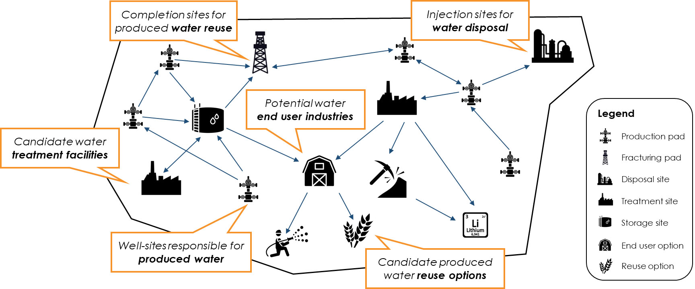
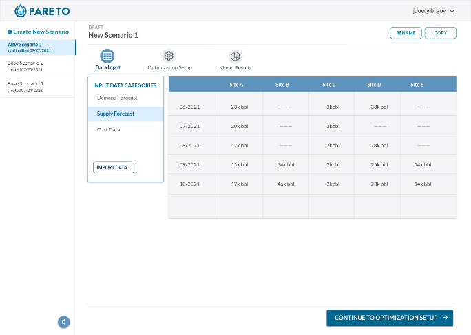
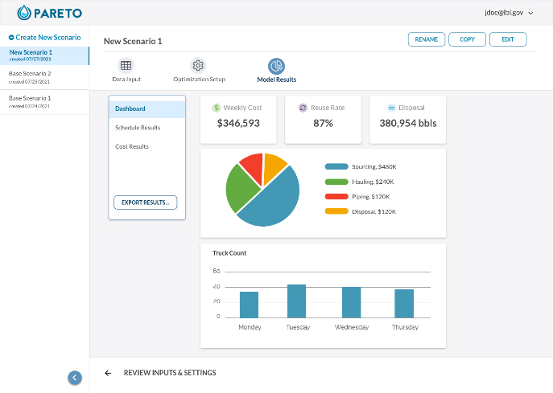

Model Library
=============

Optimization Framework
----------------------
The Produced Water Application for Beneficial Reuse, Environmental Impact and Treatment Optimization (PARETO) is specifically designed for produced water management and beneficial reuse. The major deliverable of this project will be an open-source, optimization-based, downloadable and executable produced water decision-support application, PARETO, that can be run by upstream operators, midstream companies, technology providers, water end users, research organizations and regulators.

PARETO is designed as an executable optimization-based decision-support application. In return for specifying select input data, users will be provided with specific, actionable recommendations as program outputs. The table below summarizes representative inputs and outputs.

    Figure 1. Problem Description

**Program Inputs**

* Produced water forecast
    * Quantity
    * Quality
* Transportation resources
    * Water hauling trucks
    * Produced water pipelines
* Reuse opportunities
    * Demand forecasts
    * Quality constraints
* Cost assumptions
    * cost of freshwater
    * treatment, production, and storage cost

    Figure 2. Input Data

**Program Outputs**

* Infrastructure buildout
    * Storage/treatment facilities
    * Pipeline network
* Source-to-sink matches
    * Volumetric flows
    * Blending/treatment options
* Planning and scheduling
    * Water delivery coordination
    * Operational and strategic
* Economic performance
    * Operational costs
    * Capital expenditures

    Figure 3. Output Data

It should be noted that PARETO users will be able to choose from a range of objectives for their optimization runs; these can range from minimizing costs to maximing the ruese of produced water (or combinations thereof).

Water Management Model Library
------------------------------

.. toctree::
    :maxdepth: 1

    operational_water_management/index
    strategic_water_management/index
