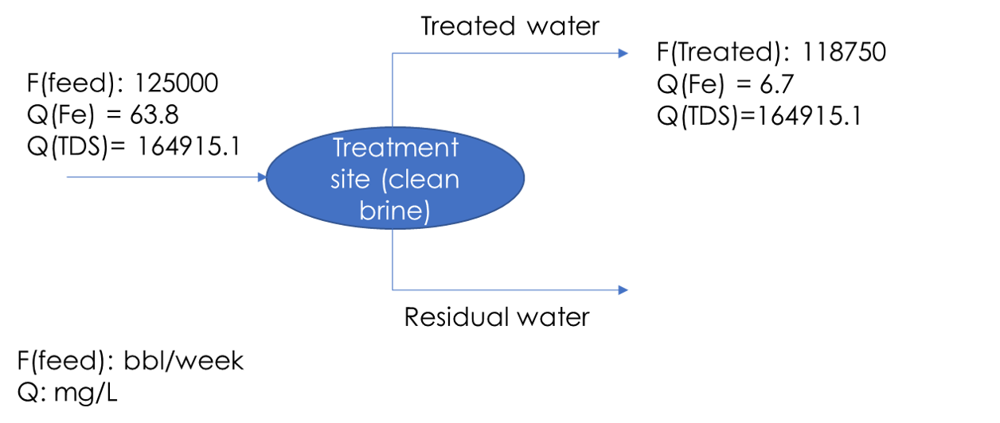

Water Treatment
===============

Overview
--------

Treatment systems play a crucial role for achieving desired water quality for various purposes, such as recycling for hydraulic fracturing, beneficial reuse applications, and critical mineral recovery.  Depending on the purpose and degree of treatment, the costs associated with treatment systems can be significant and greatly impact the investment cost in a management option. This makes it necessary to carefully consider the treatment models and their costs when evaluating produced water management strategies. Therefore, it is essential to integrate treatment models into the PARETO decision-making process. This will enable stakeholders to better understand the trade-offs between different management options and their associated costs, ultimately leading to more informed decisions.

+--------------------------------------------------------+
| Section                                                |
+========================================================+
| :ref:`treatment_model_description`                     |
+--------------------------------------------------------+
| :ref:`treatment_efficiency`                            |
+--------------------------------------------------------+
| :ref:`removal_efficiency` (recovery)                   |
+--------------------------------------------------------+
| :ref:`treatment_cost`                                  |
+--------------------------------------------------------+

.. _treatment_model_description:

Treatment Model Description
-----------------------

Water treatment systems are modeled using overall water and constituent balances, treatment and removal efficiencies, and operating cost and capital cost values/equations. The schematic in Figure 1 depicts a treatment unit that processes a treatment feed with specific qualities, yielding two output streams: treated water and residual water. The treated water and residual water streams have distinct qualities, which vary depending on the specific treatment process employed.
. The overall water and constituent balance equations for water treatment systems are as follows:

* Overall water balance: 

  .. math::

      F_{feed} = F_{treated\ water} + F_{residual\ water}

* Overall constituent balance: 

  .. math::

      F_{feed}Q_{feed} = F_{treated\ water}Q_{treated\ water} + F_{residual\ water}Q_{residual\ water}

Where:

* :math:`F_{feed}` is the influent (feed) flow rate 
* :math:`F_{treated water}` is the effluent (treated water) flow rate 
* :math:`Q_{feed}` is the influent concentration
* :math:`Q_{treated water}` is the effluent concentration

The units of concentration are typically reported as mass/volume (mg/L, g/m3, kg/L, etc.) and the units of flow rate are reported in volume/time (e.g. bbl/week).

.. _treatment_efficiency:

Water Treatment Efficiency (Recovery)
--------------------------------------

Treatment efficiency is defined as the ratio of the treated water volume to the ratio of the feed water volume to the treatment plant as follows:

.. math::
    
    \text{Treatment efficiency} = \frac{F_{treated water}}{F_{feed}}

Note that treatment efficiency can also be expressed as a percentage by multiplying the above expression by 100.

.. math::
    
    \text{Treatment efficiency (%)} = \frac{F_{treated water}}{F_{feed}} \times 100
    

.. _removal_efficiency:

Water Treatment Removal Efficiency
-----------------------------------

Removal efficiency is a measure of the overall reduction in the concentration or load of a constituent in a treatment plant, expressed as a percentage. The removal efficiency of a certain constituent is commonly calculated based on the influent (feed) concentration and the effluent (treated water) concentration as follows:

.. math::
    
    \text{Removal Efficiency (%)} = \frac{Q_{feed} - Q_{treated water}}{Q_{feed}}

For example, if the influent concentration of a constituent is 200 mg/L and the effluent concentration is 20 mg/L, then the removal efficiency can be calculated as:

.. math::
    
    \text{Removal Efficiency (%)} = \frac{200 - 20}{200} = 0.9 = 90\%

Another method for calculating removal efficiency is the measure of overall reduction in the load (mass times flow) instead of reduction in concentration. This approach is specifically useful in situations where there are substantial water losses due to evaporation and evapotranspiration. 

.. math::

   \text{Removal Efficiency (%)} = \frac{F_{feed}Q_{feed} - F_{treated water}Q_{treated water}}{F_{feed}Q_{feed}}

it should be paid attention that the load-based definition of removal efficiency will have a non-zero value even for situations where there is no concentration reduction happening, such as a simple splitter. To correctly evaluate the load-based removal efficiency in this case, considering `Qfeed = Qtreatedwater` and substituting `Qfeed` with `Qtreatedwater` in the load-based removal efficiency formula, we will obtain the removal efficiency value as follows:

Removal efficiency = 1 - treatment efficiency (recovery)

It is worth noting that in cases where there is minimal water loss to the residual stream, such that the treated water flow is approximately equal to the feed flow, the removal efficiency values obtained by the two definitions become the same. 

PARETO supports both formulations and gives the user the option to choose between the two methods based on their available data or the technology considered. The two options are expressed as `RemovalEfficiencyMethod.Concentration_based` and `RemovalEfficiencyMethod.Load_based` in PARETO configruation argument for removal efficiency.

.. _treatment_cost:

Water Treatment Cost
---------------------

In PARETO, treatment costs can be incorporated in three ways. Firstly, users may enter their own estimated values for operating and capital costs of each treatment technology. PARETO provides a treatment technology matrix (Download `here <_static/2022_10_31_206_017_PWTreatment_Technology_matrix (2).xlsx>`_.
) with data collected from available literature on various technologies, such as membrane distillation, multieffect distillation, mechanical vapor recompression, and osmotically assisted reverse osmosis. The technologies considered in this matrix are capable of treating hypersaline produced water up to saturation limits. Users may use these values to evaluate treatment options using PARETO. However, we encourage users to provide their own cost data, obtained from treatment technology vendors, to enable better evaluation of management options.
It is important to note that currently, PARETO incorporates treatment costs for discrete values of treatment capacity expansions. In other words, the treatment cost calculations are limited to specific capacity levels.

An alternative approach to incorporating treatment costs in PARETO is through the use of surrogate models. These models allow for linear or nonlinear approximations of treatment costs as a function of treatment capacity, feed quality, and recovery. This method is currently under development and not yet available in the current version of PARETO, and it is planned for inclusion in future updates.

The third method for incorporating treatment costs into PARETO is through the integration of rigorous technoeconomic optimization treatment models. These models allow for accurate capture of the effect of changes in input parameters on treatment plant performance and costs. Currently, a technoeconomic optimization-based modeling approach for single effect and multi-effect mechanical vapor compression (MVR) desalination systems is available for integration with PARETO. The following section will provide a detailed description of the MVR modeling effort.
