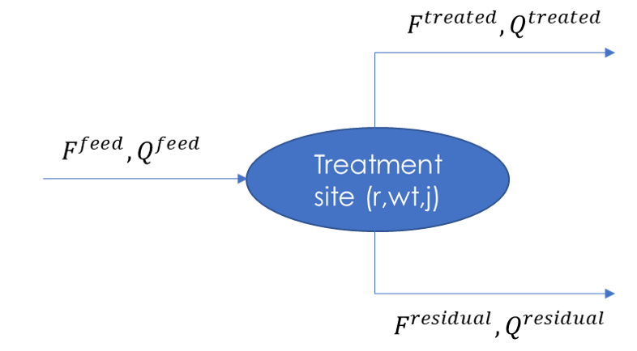
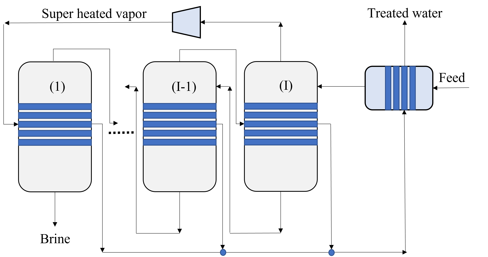
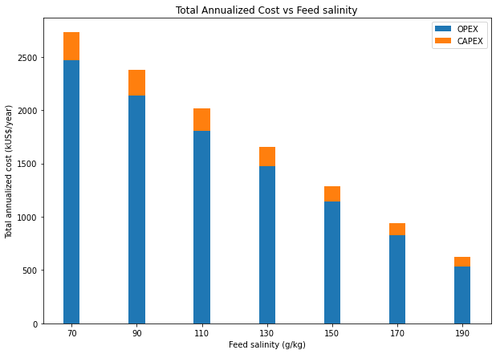
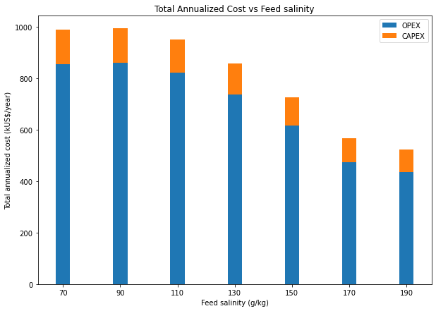

Water Treatment
===============

.. note::
   The treatment model discussed in this section primarily applies to the strategic model within PARETO. The content presented here is therefore focused on its relevance to the strategic model. Although some concepts might be applicable to PARETO as a whole, it is essential to note that component removal efficiency has not been implemented for the operational model.

Overview
-----------

Treatment systems play a crucial role for achieving desired water quality for various purposes, such as recycling for hydraulic fracturing, beneficial reuse applications, and critical mineral recovery.  Depending on the purpose and degree of treatment, the costs associated with treatment systems can be significant and greatly impact the investment cost in a management option. This makes it necessary to carefully consider the treatment models and their costs when evaluating produced water management strategies. Therefore, it is essential to integrate treatment models into the PARETO decision-making process. This will enable stakeholders to better understand the trade-offs between different management options and their associated costs, ultimately leading to more informed decisions.

+--------------------------------------------------------+
| Section                                                |
+========================================================+
| :ref:`treatmet_model_within_pareto_network`            |
+--------------------------------------------------------+
| :ref:`treatment_model_description`                     |
+--------------------------------------------------------+
| :ref:`treatment_efficiency_(water recovery)`                 |
+--------------------------------------------------------+
| :ref:`removal_efficiency`                              |
+--------------------------------------------------------+
| :ref:`treatment_cost`                                  |
+--------------------------------------------------------+
| :ref:`Mechanical_vapor_recompression_model`            |
+--------------------------------------------------------+

.. _treatmet_model_within_pareto_network:

Treatment model within PARETO network
-----------------------------------------

The PARETO network identifies treatment plants based on their location (:math:`r \in R`), capacity (:math:`j \in J`), and technology (:math:`wt \in WT`). The streams that are piped or trucked to treatment plants are represented by arcs (:math:`(l,r) \in LRA \cup LRT`), where :math:`l` can be any location or node in PARETO network. The indices :math:`j` and :math:`wt` are employed in conjunction with a binary variable to install or expand a treatment plant with a specific capacity (for further details, please refer to `strategic  water management <../strategic_water_management/index.rst>`_).
    
The following equation describes the flow balance at location :math:`r`:

.. math::
    
    \sum_{l \in L | (l, r) \in LRA \cup LRT}F_{l,r,t} = F_{r,t}^{treatment\ feed}

.. math::
    
    \sum_{l \in L | (l, r) \in LRA \cup LRT} F_{l,r,t} \cdot Q_{l,qc,t} = Q_{r,qc,t}^{treatment\ feed} \cdot F_{r,t}^{treatment\ feed}

where :math:`F` and :math:`Q` denotes the flow and quality (concentrations) of streams. The units of concentration are typically reported as mass/volume (mg/L, g/m3, kg/L, etc.) and the units of flow rate are reported in volume/time (e.g. bbl/week).

.. _treatment_model_description:

Treatment Model Description
--------------------------------

Water treatment systems are modeled using overall water and constituent balances, treatment and removal efficiencies, and operating cost and capital cost values/equations. The schematic in Figure 1 depicts a treatment unit that processes a treatment feed with specific qualities, yielding two output streams: treated water and residual water. The treated water and residual water streams have distinct qualities, which vary depending on the specific treatment process employed.
The overall water and constituent balance equations for water treatment systems are as follows:
  

    Figure 1. Treatment plant schematic
 

* Overall water balance: 

  .. math::

      F^{treatment\ feed} = F^{treated\ water} + F^{residual\ water}

* Overall constituent balance: 

  .. math::

      F^{treatment\ feed}Q^{feed} = F^{treated\ water}Q^{treated\ water} + F^{residual\ water}Q^{residual\ water}

.. _treatment_efficiency_(recovery):

Treatment Efficiency (water recovery fraction)
--------------------------------------

Treatment efficiency is defined as the ratio of the treated water volume to the ratio of the feed water volume to the treatment plant as follows:

.. math::
    
    \text{Treatment efficiency} = \frac{F^{treated\ water}}{F^{treatment\ feed}}

Note that treatment efficiency can also be expressed as a percentage by multiplying the above expression by 100.

.. math::
    
    \text{Treatment efficiency (%)} = \frac{F^{treated\ water}}{F^{feed}} \times 100
    

.. _removal_efficiency:

Treatment Component Removal Efficiency
-----------------------------------

Removal efficiency is a measure of the overall reduction in the concentration or load of a constituent in a treatment plant, expressed as a percentage. The removal efficiency of a certain constituent is commonly calculated based on the influent (feed) concentration and the effluent (treated water) concentration as follows:

.. math::
    
    \text{Removal Efficiency (%)}_{concentration} = \frac{Q^{treatment\ feed} - Q^{treated\ water}}{Q^{treatment\ feed}} \times 100

For example, if the influent concentration of a constituent is 200 mg/L and the effluent concentration is 20 mg/L, then the removal efficiency can be calculated as:

.. math::
    
    \text{Removal Efficiency (%)}_{concentration} = \frac{200 - 20}{200} = 0.9 = 90\%

Another method for calculating removal efficiency is the measure of overall reduction in the load of the contaminant (volumetric flowrate times concentration) instead of reduction in concentration. This approach is specifically useful in situations where there are substantial water losses due to evaporation and evapotranspiration. 

.. math::

   \text{Removal Efficiency (%)}_{load} = \frac{F^{treatment\ feed}Q^{treatment\ feed} - F^{treated\ water}Q^{treated\ water}}{F^{treatment\ feed}Q^{treatment\ feed}} \times 100

it should be noted that the load-based definition of removal efficiency will have a non-zero value even for situations where there is no concentration reduction happening, such as a simple splitter. In such cases, introducing an equality constraint on the quality of the streams in the load-based approach will result in the following equation:

.. math::

    Q^{treatment\ feed} = Q^{treated\ water}  

.. math::
    
    \text{Removal efficiency}_{load} = 1 - \text{treatment efficiency}

It is worth noting that in cases where there is minimal water loss to the residual stream, such that the treated water flow is approximately equal to the feed flow, the removal efficiency values obtained by the two definitions (concentration based and load based) become the same. 

PARETO supports both formulations and gives the user the option to choose between the two methods based on their available data or the technology considered. The two options are expressed as ``RemovalEfficiencyMethod.Concentration_based`` and ``RemovalEfficiencyMethod.Load_based`` in PARETO configruation argument for removal efficiency.

.. _treatment_cost:

Treatment Cost
---------------------

The total cost of produced water treatment consist of capital costs and annual operating costs. Capital costs include the costs associated with the land purchanse, construction, purchasing process equipment, and installation. Annual operating costs refer to the cost during plant operation such as cost of energy, equimpment replacement, chemicals, labor, and maintenance. The sum of the unit operating costs and the unit annualized capital costs determines the total capital cost per unit volume of produced water.

Treatment costs can be incorporated into PARETO with three methods. To begin, users can provide their own estimated capital and operating costs for each treatment technology. PARETO provides a treatment technology matrix (shown below) with data collected from available literature on various technologies such as membrane distillation, multi-effect distillation, mechanical vapor recompression, and osmotically assisted reverse osmosis (for further detail regarding selected technologies and references please refer to the provided sheet: :download:`treatment matrix <../2022_10_31_206_017_PWTreatment_Technology_matrix.xlsx>`). The technologies considered in this matrix are capable of treating hypersaline produced water up to saturation limits. Users may use these values to evaluate treatment options using PARETO. However, we encourage users to provide their own cost data, obtained from treatment technology vendors, to enable better evaluation of management options.
It is important to note that currently, PARETO incorporates treatment costs for discrete values of treatment capacity expansions. In other words, the treatment cost calculations are limited to specific capacity levels.

+-------------------------------------------------------------------------------+-----------------+--------------------------------+-------------------------------------------+--------------------------------------------+-------------------------------------------+-------------------------------------------+-------------------------------------------+--------------------------------------------+--------------------------------------------+--------------------------------------------+--------------------------------------------------------+--------------------------------------------+--------------------------------------------+--------------------------------------------------+--------------------------------------------+
|                                   Treatment Technology                        |  Pretreatment   | Multiple effect evaopration    | Mechanical vapor compression (MVC)        | Direct contact membrane distillation (DCMD)| Air gap membrane distillation (AGMD)      | Permeate gap membrane distillation (PGMD) |Conductive gap membrane distillation (CGMD)| Sweeping gas membrane distillation (SGMD)  | Vacuum membrane distillation (VMD)         | Osmotically assisted reverse osmosis (OARO)| Cascading osmotically mediated reverse osmosis (COMRO) | Low-salt rejection reverse osmosis (LSRRO) | Brine reflux OARO (BR-OARO)                | Split feed counterflow reverse osmosis (SF-OARO) | Consecutive loop OARO (CL-OARO)            |
+===============================================================================+=================+================================+===========================================+============================================+===========================================+===========================================+===========================================+============================================+============================================+============================================+========================================================+============================================+============================================+==================================================+============================================+
|CAPEX [$ / (bbl feed/day)]                                                     | 60 - 90         | 726                            | 1092                                      | 363-1148                                   | 511-589                                   | 534-749                                   | 461-645                                   | 1339                                       | 314-689                                    | 448-1432                                   | 1301                                                   | 965                                        | 1389                                       | 1777                                             | 2181                                       |
+-------------------------------------------------------------------------------+-----------------+--------------------------------+-------------------------------------------+--------------------------------------------+-------------------------------------------+-------------------------------------------+-------------------------------------------+--------------------------------------------+--------------------------------------------+--------------------------------------------+--------------------------------------------------------+--------------------------------------------+--------------------------------------------+--------------------------------------------------+--------------------------------------------+
|OPEX [$ / bbl feed]                                                            | 0.04 - 1.50     | 1.25                           | 0.34                                      | 0.61-1.51                                  | 0.43-0.62                                 | 1.28-3.80                                 | 0.53-1.15                                 | 1.27                                       | 0.45-1.77                                  | 0.066-0.32                                 | 0.47                                                   | 0.43                                       | 0.51                                       | 0.55                                             | 0.68                                       |
+-------------------------------------------------------------------------------+-----------------+--------------------------------+-------------------------------------------+--------------------------------------------+-------------------------------------------+-------------------------------------------+-------------------------------------------+--------------------------------------------+--------------------------------------------+--------------------------------------------+--------------------------------------------------------+--------------------------------------------+--------------------------------------------+--------------------------------------------------+--------------------------------------------+
|total annualized cost [$ / bbl feed]                                           | 0.07 - 1.40     | 1.57                           | 0.82                                      | 0.79-1.83                                  | 0.56-0.73                                 | 1.44-3.92                                 | 0.67-1.25                                 | 1.56                                       | 0.60-1.84                                  | 0.12-0.54                                  | 0.83                                                   | 0.7                                        | 0.82                                       | 0.94                                             | 1.15                                       |
+-------------------------------------------------------------------------------+-----------------+--------------------------------+-------------------------------------------+--------------------------------------------+-------------------------------------------+-------------------------------------------+-------------------------------------------+--------------------------------------------+--------------------------------------------+--------------------------------------------+--------------------------------------------------------+--------------------------------------------+--------------------------------------------+--------------------------------------------------+--------------------------------------------+
| Plant capacity [bbl feed/ day]                                                | 3774            | 5661                           | 5661                                      | 5079                                       | 5079                                      | 5079                                      | 5079                                      | 5079                                       | 5079                                       | 2944                                       | 2944                                                   | 2944                                       | 5079                                       | 5079                                             | 5079                                       |
+-------------------------------------------------------------------------------+-----------------+--------------------------------+-------------------------------------------+--------------------------------------------+-------------------------------------------+-------------------------------------------+-------------------------------------------+--------------------------------------------+--------------------------------------------+--------------------------------------------+--------------------------------------------------------+--------------------------------------------+--------------------------------------------+--------------------------------------------------+--------------------------------------------+
| TDS operating limits [mg/L]                                                   | N/A             | 0-350,000                      | 0-350,000                                 | 0-350,000                                  | 0-350,000                                 | 0-350,000                                 | 0-350,000                                 | 0-350,000                                  | 0-350,000                                  | 0-350,000                                  | 0-350,000                                              | 0-350,000                                  | 0-350,000                                  | 0-350,000                                        | 0-350,000                                  |
+-------------------------------------------------------------------------------+-----------------+--------------------------------+-------------------------------------------+--------------------------------------------+-------------------------------------------+-------------------------------------------+-------------------------------------------+--------------------------------------------+--------------------------------------------+--------------------------------------------+--------------------------------------------------------+--------------------------------------------+--------------------------------------------+--------------------------------------------------+--------------------------------------------+
| Energy type                                                                   | Varies          | Thermal                        | Electrical                                | Thermal                                    | Thermal                                   | Thermal                                   | Thermal                                   | Thermal                                    | Thermal                                    | Electrical                                 | Electrical                                             | Electrical                                 | Electrical                                 | Electrical                                       | Electrical                                 |
+-------------------------------------------------------------------------------+-----------------+--------------------------------+-------------------------------------------+--------------------------------------------+-------------------------------------------+-------------------------------------------+-------------------------------------------+--------------------------------------------+--------------------------------------------+--------------------------------------------+--------------------------------------------------------+--------------------------------------------+--------------------------------------------+--------------------------------------------------+--------------------------------------------+
| Theoretical energy requirements [kWh/m3]                                      | Varies          | 200 kWth/m3                    | 20-30                                     | 182-359 kWth/m3                            | 117-167 kWth/m3                           | 395-1214 kWth/m3                          | 164-354 kWth/m3                           | 364 kWth/m3                                | 130-640 kWth/m3                            | 8-20                                       | 12.8                                                   | 28.9                                       | 16.13                                      | 17.46                                            | 26.6                                       |
+-------------------------------------------------------------------------------+-----------------+--------------------------------+-------------------------------------------+--------------------------------------------+-------------------------------------------+-------------------------------------------+-------------------------------------------+--------------------------------------------+--------------------------------------------+--------------------------------------------+--------------------------------------------------------+--------------------------------------------+--------------------------------------------+--------------------------------------------------+--------------------------------------------+
| Water recovery [%]                                                            | Varies          | 82                             | 82                                        | varies                                     | 74                                        | 74                                        | 74                                        | 74                                         | 74                                         | varies                                     | 75                                                     | 75                                         | 74                                         | 74                                               | 74                                         |
+-------------------------------------------------------------------------------+-----------------+--------------------------------+-------------------------------------------+--------------------------------------------+-------------------------------------------+-------------------------------------------+-------------------------------------------+--------------------------------------------+--------------------------------------------+--------------------------------------------+--------------------------------------------------------+--------------------------------------------+--------------------------------------------+--------------------------------------------------+--------------------------------------------+
| Inlet salinity [mg/ LTDS]                                                     | N/A             | 70                             | 70                                        |varies                                      | 100                                       | 100                                       | 100                                       | 100                                        | 100                                        | varies                                     | 70                                                     | 70                                         | 100                                        | 100                                              | 100                                        |
+-------------------------------------------------------------------------------+-----------------+--------------------------------+-------------------------------------------+--------------------------------------------+-------------------------------------------+-------------------------------------------+-------------------------------------------+--------------------------------------------+--------------------------------------------+--------------------------------------------+--------------------------------------------------------+--------------------------------------------+--------------------------------------------+--------------------------------------------------+--------------------------------------------+
| Brine salinity [mg/L TDS]                                                     | N/A             | 300000                         | 300000                                    | 300000                                     | 300000                                    | 300000                                    | 300000                                    | 300000                                     | 300000                                     | 230000                                     | 230000                                                 | 300000                                     | 300000                                     | 300000                                           |300000                                      |
+-------------------------------------------------------------------------------+-----------------+--------------------------------+-------------------------------------------+--------------------------------------------+-------------------------------------------+-------------------------------------------+-------------------------------------------+--------------------------------------------+--------------------------------------------+--------------------------------------------+--------------------------------------------------------+--------------------------------------------+--------------------------------------------+--------------------------------------------------+--------------------------------------------+

An alternative approach to incorporating treatment costs in PARETO is through the use of surrogate models. These models allow for linear or nonlinear approximations of treatment costs as a function of treatment capacity, feed quality, and recovery. This method is currently under development and not yet available in the current version of PARETO, and it is planned for inclusion in future updates.

The third method for incorporating treatment costs into PARETO is through the integration of rigorous technoeconomic optimization treatment models. These models allow for accurate capture of the effect of changes in input parameters on treatment plant performance and costs. Currently, a technoeconomic optimization-based modeling approach for single effect and multi-effect mechanical vapor compression (MVR) desalination systems is available for integration with PARETO. The following section will provide a detailed description of the MVR modeling effort.

.. _Mechanical_vapor_recompression_model:

Mechanical vapor recompression model
--------------------------------------

Single effect evaporation and multi effect evaporation has been studied for shale water desalination. Mechanical vapor recompression, uses a compressor to utilize the heat from the evaporated vapor for further evaporation. As shown in the schematic in Figure (2), for a system with I effects, the produced water is fed into evaporator I. After evaporation, the brine from the i\ :sup:`th` effect is sent to the (i-1)\ :sup:`th` effect and the vapor from the (i-1)\ :sup:`th` effect is sent to the i\ :sup:`th` effect.

    Figure 2. MEE-SVR treatment flowsheet

The vapor from the i\ :sup:`th` evaporator is sent to the compressor for recompression. The superheated vapor from the compressor is then sent into the tubes of the 1\ :sup:`st` evaporator to carry out the evaporation process. The condensate from all the evaporator effects is sent to the preheater where it preheats the feed and thus aids in heat integration.

Model Description
------------------

The multi-effect evaporator model is built to consider multiple evaporator effects. The user can specify the number of effects, feed flow rate, TDS concentration in feed and the minimum TDS specification in the brine. The model then calculates the capital costs, operating costs, compressor work, compressor capacity, evaporator heat exchange area and the preheater area. The user can also obtain the pressures, temperatures and concentrations of the individual streams. 
The model is built in Pyomo and is based on equations taken from Onishi's 2017 paper on shale gas flowback water desalination. 

Variable Definitions
+++++++++++++++++++++

.. list-table:: Variable definitions
    :widths: 15 50 15 15
    :header-rows: 1

    * - Symbol
      - Doc
      - Units
      - Index sets
  
    * - :math:`{F_{in}}`
      - Flow rate of the feed
      - kg/s
      - None
  
    * - :math:`{F_{brine}}`
      - Flow rate of brine
      - kg/s
      - i
  
    * - :math:`{F_{vapor}}`
      - Flow rate of the vapor
      - kg/s
      - i

    * - :math:`{F_{spv}}`
      - Flow rate of super heated vapor
      - kg/s
      - None

    * - :math:`{F_{freshwater}}`
      - Flow rate of fresh water
      - kg/s
      - None

    * - :math:`{T_{feed}}`
      - Temperature of feed water
      - :math:`{^{\circ} C}`
      - None

    * - :math:`{T_{in}}`
      - Temperature of water entering the :math:`{I^{th}}`
      - :math:`{^{\circ} C}`
      - None

    * - :math:`{T_{cond}}`
      - Temperature of condensate
      - :math:`{^{\circ} C}`
      - i

    * - :math:`{T_{brine}}`
      - Temperature of brine
      - :math:`{^{\circ} C}`
      - i

    * - :math:`{T_{vapor}}`
      - Temperature of vapor from the evaporators
      - :math:`{^{\circ} C}`
      - i

    * - :math:`{T_{spv}}`
      - Temperature of super heated vapor
      - :math:`{^{\circ} C}`
      - None

    * - :math:`{T_{ideal}}`
      - Ideal temperature in th evaporators
      - :math:`{^{\circ} C}`
      - i
  
    * - :math:`{T_{sv}}`
      - Temperature of saturated vapor
      - :math:`{^{\circ} C}`
      - i
  
    * - :math:`{T_{mix}^{out}}`
      - Temperature of mixer outlet
      - :math:`{^{\circ} C}`
      - None

    * - :math:`{T_{freshwater}}`
      - Temperature of fresh water
      - :math:`{^{\circ} C}`
      - None

    * - BPE
      - Boiling point elevation
      - :math:`{^{\circ} C}`
      - i

    * - :math:`{H_{feed}}`
      - Enthalpy of the feed water
      - kJ/kg
      - None

    * - :math:`{H_{in}}`
      - Enthalpy of the water entering the :math:`{I^{th}}` evaporator
      - kJ/kg
      - None

    * - :math:`{H_{brine}}`
      - Enthalpy of brine
      - kJ/kg
      - i

    * - :math:`{H_{vapor}}`
      - Enthalpy of vapor
      - kJ/kg
      - i

    * - :math:`{H_{spv}}`
      - Enthalpy of super heated vapor
      - kJ/kg
      - None

    * - :math:`{H_{cond}^{vap}}`
      - Enthalpy of condensate vapor
      - kJ/kg
      - None

    * - :math:`{H_{cond}}`
      - Enthalpy of condensate
      - kJ/kg
      - None

    * - :math:`{P_{vapor}}`
      - Vapor pressure in the evaporator
      - kPa
      - i

    * - :math:`{P_{sv}}`
      - Saturated vapor pressure
      - kPa
      - i

    * - :math:`{P_{spv}}`
      - Pressure of the super heated vapor
      - kPa
      - None
  
    * - :math:`{Q_{in}}`
      - TDS concentration of the feed
      - g/kg
      - None
  
    * - :math:`{Q_{brine}}`
      - TDS concentration in the brine
      - g/kg
      - i
  
    * - :math:`{Q_{spec}}`
      - TDS specification in the outlet brine stream
      - g/kg
      - None

    * - :math:`{X_{s}^{in}}`
      - Mass fraction of TDS in feed
      - (-)
      - None

    * - :math:`{X_{s}^{brine}}`
      - Mass fraction of TDS in brine
      - (-)
      - i
  
    * - E
      - Heat flow in the evaporator
      - kW
      - i
  
    * - :math:`{W_{compr}}`
      - Work done by the compressor
      - kW
      - None
  
    * - :math:`{C_{compr}}`
      - Capacity of the compressor
      - HP 
      - None
  
    * - :math:`{\eta}`
      - Isentropic efficiency of the compressor
      - (-)
      - None

    * - :math:`{U_{evap}}`
      - Overall heat transfer coefficient of the evaporator (latent heat)
      - :math:`{\frac{kW}{m^2K}}`
      - i
  
    * - :math:`{U_{s}}`
      - Overall heat transfer coefficient of the evaporator (Sensible heat)
      - :math:`{\frac{kW}{m^2K}}`
      - None
  
    * - :math:`{U_{ph}}`
      - Overall heat transfer coefficient of the preheater
      - :math:`{\frac{kW}{m^2K}}`
      - None

    * - :math:`{A_{evap}}`
      - Area of the evaporator
      - :math:`{m^2}`
      - i

    * - :math:`{A_{ph}}`
      - Area of the preheater
      - :math:`{m^2}`
      - None

    * - :math:`{C_{p}^{feed}}`
      - Specific heat capacity of the feed water
      - :math:`{kJ/(kg ^{\circ}C)}`
      - None

    * - :math:`{C_{p}^{vapor}}`
      - Specific heat capacity of vapor
      - :math:`{kJ/(kg ^{\circ}C)}`
      - None

    * - :math:`{C_{p}^{mix}}`
      - Specific heat capacity of water from the outlet of the mixer
      - :math:`{kJ/(kg ^{\circ}C)}`
      - None

    * - :math:`{{\Delta}T }`
      - Approach temperatures
      - :math:`{^{\circ}C}`
      - None

    * - :math:`{{\Delta}P }`
      - Minimum pressure difference between evaporator stages
      - :math:`{kPa}`
      - None

    * - :math:`{C_{elec}}`
      - Cost of electricity  
      - :math:`{kUSD/kW year}`
      - None

    * - :math:`{CAPEX_{evap}}`
      - Capital cost for all evaporators
      - :math:`{kUSD}`
      - None

    * - :math:`{CAPEX_{ph}}`
      - Capital cost for Preheater
      - :math:`{kUSD}`
      - None

    * - :math:`{CAPEX_{compr}}`
      - Capital cost for compressor 
      - :math:`{kUSD}`
      - None

    * - :math:`{OPEX_{ann}}`
      - Annualized operating cost
      - :math:`{kUSD/year}`
      - None

    * - :math:`{CAPEX_{ann}}`
      - Annualized capital cost
      - :math:`{kUSD/year}`
      - None

Modeling Equations
-------------------

Evaporator model
++++++++++++++++

Flow balance in the evaporators:

.. math::

    F_{in} = F_{brine}^{(I)} + F_{vapor}^{(I)}

    F_{in}^{(i+1)} = F_{brine}^{(i)} + F_{vapor}^{(i)} \quad \forall i < I

Flow matching between super heated vapor and flow of vapor from the evaporator:

.. math:: 

    F_{spv} = F_{vapor}^{(I)}

Mass balance in the evaporators:

.. math:: 

    F_{in}Q_{in} = F_{brine}^{(I)}Q_{brine}^{(I)}

    F_{brine}^{(i+1)}Q_{brine}^{(i+1)}=F_{brine}^{(i)}Q_{brine}^{(i)} \quad \forall i < I

Calculating mass fraction of salt from salt salinity:

.. math:: 

    X_{s}^{in} = 0.001 Q_{in}

    X_s^{(i)} = 0.001 Q_{brine}^{(i)} \quad \forall i \in \{0,...,I\}

Energy balance in the evaporator:

.. math:: 

    E^{(I)} + F_{in}H_{in} = F_{brine}^{(I)}H_{brine}^{(I)} + F_{vapor}^{(I)}H_{vapor}^{(I)}

    E^{(i)} + F_{brine}^{(i+1)}H_{brine}^{(i+1)} = F_{brine}^{(i)}H_{brine}^{(i)} + F_{vapor}^{(i)}H_{vapor}^{(i)} \quad \forall i < I

    E^{(1)} =  F_{spv}C_p^{vapor}(T_{spv} - T_{cond}^{(1)}) + F_{spv}(H_{cond}^{vap(1)} - H_{cond}^{(1)})

    E^{(i)} = F_{vapor}^{(i-1)} \lambda^{(i)} \quad \forall i \in \{2,...,I\}

Thermodynamic Relations

Relating pressures to temperatures using the Antoine equation: 

.. math:: 

    log(P_{vapor}^{(i)}) = a + \frac{b}{T_{ideal}^{(i)} + c} \quad \forall i \in \{1,.., I\}

    log(P_{spv}^{(1)}) = a + \frac{b}{T_{cond}^{(1)} + c}

    log(P_{sv}^{(i)}) = a + \frac{b}{T_{sv}^{(i)} + c} \quad \forall i \in \{2,..., I\}

Calculating elevation in boiling point due to TDS in the feed water:

.. math:: 

    BPE^{(i)} = 0.1581 + 2.769 X_{s}^{(i)} - 0.002676 T_{ideal}^{(i)}+ 41.78 X_{s}^{(i)2} + 0.134 X_{s}^{(i)}T_{ideal}^{(i)}

Calculating temperature of brine from BPE and ideal temperature in the evaporator:

.. math:: 

    T_{brine}^{(i)} = T_{ideal}^{(i)} + BPE^{(i)}

Estimating the enthalpies:

.. math:: 

    H_{in} = -15940 + 8787X_{s}^{in} + 3.557 T_{in}

    H_{brine}^{(i)} = -15940 + 8787X_{s}^{(i)} + 3.557 T_{brine}^{(i)}\quad \forall i \in \{1,..., I\}

    H_{vapor}^{(i)} = -13470 + 1.84 T_{brine}^{(i)}\quad \forall i \in \{1,..., I\}

    H_{cond}^{(i)vap} = -13470 + 1.84T_{cond}^{(i)}\quad \forall i \in \{1,..., I\}

    H_{cond}^{(i)} = -15940 + 3.557T_{cond}^{(i)}\quad \forall i \in \{1,..., I\}

Calculating LMTD:

.. math:: 

    \theta_1^{(i)} = T_{spv} - T_{brine}^{(i)} \quad \text{for } i = 1

    \theta_1^{(i)} = T_{sv}^{(i)} - T_{brine}^{(i)} \quad \forall i > 1

    \theta_2^{(i)} = T_{cond}^{(i)} - T_{brine}^{(i+1)} \quad \text{for } i = 1

    \theta_2^{(i)} = T_{sv}^{(i)} - T_{brine}^{(i+1)} \quad \forall i \in \{2,.., I-1\}

    \theta_2^{(i)} = T_{sv}^{(i)} - T_{in} \quad \text{for } i = I

    LMTD^{(i)} = (0.5\theta_1^{(i)}\theta_2^{(i)}(\theta_1^{(i)}+\theta_2^{(i)}))^{1/3}

Heat transfer coefficient for evaporator:

.. math:: 

    U_{evap}^{i} = 0.001(1939.4 + 1.40562T_{brine}^{(i)} - 0.002T_{brine}^{(i)2}+ 0.0023T_{brine}^{(i)3})

Design Equations:

Area of first evaporator calculation:

.. math:: 

    A_{evap}^{(1)} = F_{spv}C_{p}^{vapor}\frac{(T_{spv} - T_{cond}^{(1)})}{U_{s}(LMTD^{(1)})} + F_{spv}\frac{H_{cond}^{(1)vap} - H_{cond}^{(1)}}{U_{evap}^{(1)}(T_{cond}^{(1)} - T_{brine}^{(1)})}

Total Evaporator Area:

.. math:: 

     A_{evap}^{total} = \sum_{i=1}^{I}\frac{E^{(i)}}{U_{evap}^{(i)}LMTD^{(i)}}

Compressor Model
++++++++++++++++

**Thermodynamic Relations**

Isentropic temperature calculation:

.. math:: 

    T_{is} = (T_{brine}^{(I)} + 273.5)(\frac{P_{spv}}{P_{vapor}^{I}})^{\frac{\gamma -1}{\gamma}} - 273.5

Temperature of the super heated vapor can be calculated as:

.. math:: 

    T_{spv} = T_{brine}^{(I)} + \frac{1}{\eta}(T_{is} - T_{brine}^{(I)})

The enthalpy of the super heated vapor can be estimated by:

.. math:: 

    H_{spv} = -13470 + 1.84T_{spv}

**Design Equations**

The compression work is given by:

.. math::
    
    W_{compr} = F_{spv}(H_{spv} - H_{vap}^{(I)})

The compressor capacity in horse power is given by:

.. math:: 

    \mathcal{C}_{compr} = W_{compr} \times 1.34

Mixer Model
++++++++++++

Mass balance in the mixer:

.. math:: 
    
    F_{fresh water} = \sum_{i = 1}^{I}F_{vapor}^{i}

Energy balance in the mixer:

.. math:: 

    T_{mix}^{out} = \frac{\sum_{i = 1}^{I} F_{vapor}^{(i)}T_{brine^{(i)}}}{F_{freshwater}}

Preheater Model
+++++++++++++++

Energy balance in the preheater:

.. math:: 

    F_{freshwater}C_p^{mix}(T_{mix}^{out} - T_{freshwater}) = F_{in}C_{p}^{feed}(T_{in} - T_{feed})

**Thermodynamic Relations**

Estimating specific heat capacities:

.. math:: 

    C_p^{feed} = 0.001(4206.8 - 6.6197 Q_s^{in} + 1.22 \times 10^{-2} Q_{s}^{in^2} + (-1.262 + 5.418 \times 10^{-2}Q_s^{in})T_{feed})

    C_p^{mix} = 0.001(4206.8 - 1.1262 T_{mix}^{out})

Preheater heat transfer coefficient calculation:

.. math:: 

    U_{ph} = 0.001(1939.4 + 1.40562T_{mix}^{out} - 0.002T_{mix}^{out2} + 0.0023T_{mix}^{out3})

Preheater LMTD calculation:

.. math:: 

    \theta_{1ph} = T_{mix}^{out} - T_{in}

    \theta_{2ph} = T_{freshwater} - T_{feed}

     LMTD_{ph} = (0.5 \theta_{1ph} \theta_{2ph}(\theta_{1ph} + \theta_{2ph}))^{1/3}

**Design Equations**

Preheater area calculation:

.. math:: 

    A_{ph} = \frac{F_{freshwater}C_p^{mix}(T_{mix}^{out} - T_{freshwater})}{U_{ph}LMTD_{ph}}

Bounds for feasible operation:

.. math:: 

    T_{spv} \geq T_{cond}^{(1)} + \Delta T_1^{min}

    T_{brine}^{(I)} \geq T_{in} + \Delta T_{2}^{min}

    T_{cond}^{(I)} \geq T_{in} + \Delta T^{min}

    T_{brine}^{(i-1)} \geq T_{cond}^{(i)} + \Delta T_1^{min} \quad \forall i \in \{2,..,I\}

    T_{brine}^{(i-1)} \geq T_{brine}^{(i)} + \Delta T_{stage}^{min} \quad \forall i \in \{2,..,I\}

    T_{cond}^{(i)} \geq T_{brine}^{(i+1)} + \Delta T^{min} \quad \forall i \in \{1,..,I-1\}

    T_{cond}^{(i)} \geq T_{brine}^{(i)} + \Delta T^{min} \quad \forall i \in \{1,...,I\}

    T_{sv}^{(i)} \geq T_{brine}^{(i)} + \Delta T^{min} \quad \forall i \in \{1,...,I\}

    P_{vapor}^{(i)} \geq P_{vapor}^{i+1} + \Delta P^{min} \quad \forall i \in \{1,...,I-1\}

    CR_{max}P_{vapor}^{(I)} \geq P_{spv} \geq P_{vapor}^{(I)}

    S_{brine}^{(1)} \geq S_{spec}

Objective function
++++++++++++++++++

The goal is to minimize the total annualized cost (TAC) of the treatent unit. CAPEX of the equipments were calculated using empirical relations from IDAES costing. Assuming the evaporator is a U-tube heat exchanger, the CAPEX of the evaporators in kUSD is given by:

.. math:: 

    CAPEX_{evap} = \frac{CEPCI_{2022}}{CEPCI_{base}}\frac{1.05}{1000}\sum_{i = 1}^{N_{evap}} exp(11.3852 -0.9186(log(A_{evap}^{(i)}\times 1.1)) + 0.0979(log(A_{evap}^{(i)}\times 1.1))^2 )

CAPEX of centrifugal compressor in kUSD is given by:

.. math:: 

    CAPEX_{compr} = \frac{CEPCI_{2022}}{CEPCI_{base}}\sum_{i = 1}^{N_{compr}} exp(7.58 + 0.8\times log(\mathcal{C}_{compr}))

Assuming the preheater is a U-tube heat exchanger, the CAPEX of the preheater is given by:

.. math:: 

    CAPEX_{ph} = \frac{CEPCI_{2022}}{CEPCI_{base}}\frac{1.05}{1000} (exp(11.3852 -0.9186(log(A_{ph} \times 1.1)) + 0.0979(log(A_{ph} \times 1.1))^2 ))

Note: For CAPEX calculation, the areas have to be in sq. ft.

The total CAPEX is given by: 

.. math:: 

    CAPEX = CAPEX_{evap} + CAPEX_{compr} + CAPEX_{ph}

Annualization factor: The annualization factor for CAPEX is calculated based on fractional interest rate :math:`r = 0.1` per year and amortization period :math:`y = 10` years. 

.. math:: 

    fac =  \frac{r(1+r)^y}{(1+r)^y -1}

The annualized CAPEX is calculated by:

.. math:: 

    CAPEX_{ann} = fac \times CAPEX

The cost of operating the treatment unit comes from operating the compressor using electricity. 

.. math:: 

    OPEX_{ann} = C_{elec} \times W_{compr}

The total annualized cost is therefore given by: 

.. math:: 

    TAC = CAPEX_{ann} + OPEX_{ann}

This is our objective function which we'll minimize. 

Sensitivity Analysis
++++++++++++++++++++

To demonstrate the effect of the feed salinity on the TAC, we consider a single effect evaporator without heat integration using a preheater. The feed flow rate is fixed to 10 kg/s and the outlet brine TDS concentration needs to be above 250 g/kg. The salt concentration in the feed is varied from 70 g/kg to 190 g/kg. A plot of feed salinity vs TAC is generated as shown in Figure 3:

    Figure 3. TAC vs feed salinity for a single effect evaporator

For the same conditions, the sensitivity analysis for a multi-effect evaporator with two stages and heat integration using a preheater is shown in Figure 4:

    Figure 4. TAC vs feed salinity for a two effect evaporator with heat integration