=========================
How To Use User Interface
=========================

.. _how-to-use-ui-page:

Step-by-step guide
------------------

.. container::

   .. container::

      .. rubric:: PARETO User Interface
         :name: pareto-user-interface
         :class: text-header

      .. container::

         **Step 1.** Download the latest version of PARETO for your
         operating system at the `Project PARETO Website <https://www.project-pareto.org/software>`_.

         .. container:: screenshot-div

            |software-website|

         **Step 2.** Follow the installation steps to install the
         application. For windows, see below:

         .. container:: screenshot-div

            |windows-installer|

         **Step 3.** Run the application, you should see a splash page
         before being redirected to the scenarios page:

         .. container:: screenshot-div
            
            |scenarios-page|

         **Step 4.** Click on "Create new scenario". Download from one
         of the available sample inputs, or use your own data, then name the scenario and click
         "Create scenario":

         .. container:: screenshot-div

            |create-scenario|

         **Step 5.** Browse the input plots and tables, with the option
         to edit any of the inputs:

         .. container:: screenshot-div

            |input-page|

         **Step 6.** Click the "optimization setup" button, and choose
         from our model settings. If you have a gurobi license, select
         "gurobi" from the solver options:

         .. container:: screenshot-div

            |model-settings|

         **Step 7.** Click "run model":

         .. container:: screenshot-div

            |running-model|

         **Step 8.** When the model is finished running, the KPI
         dashboard will be visible from the model results section:

         .. container:: screenshot-div

            |kpi-dashboard.|

         **Step 9.** Analyze the output by looking through tables and
         graphs, including the sankey diagram that interactively
         displays the distribution of produced water:

         .. container:: screenshot-div

            |sankey-diagram|

         **Step 10.** If you are unhappy with any of PARETO's
         infrastructure decisions, feel free to override with your own
         decisions in the "infrastructure buildout" tab:

         .. container:: screenshot-div

            |infrastructure-override|

         **Step 11.** Compare different scenarios by clicking on any of
         the compare icons from the scenario page:

         .. container:: screenshot-div

            |scenario-comparison|

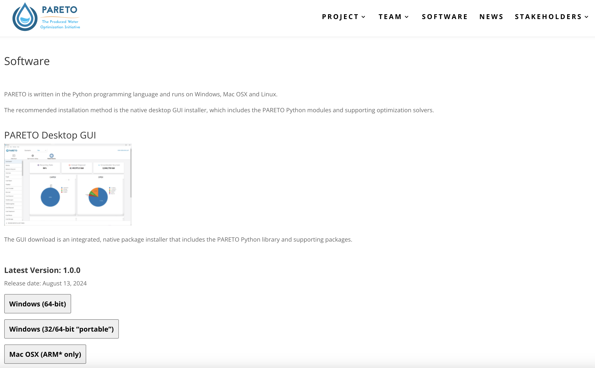
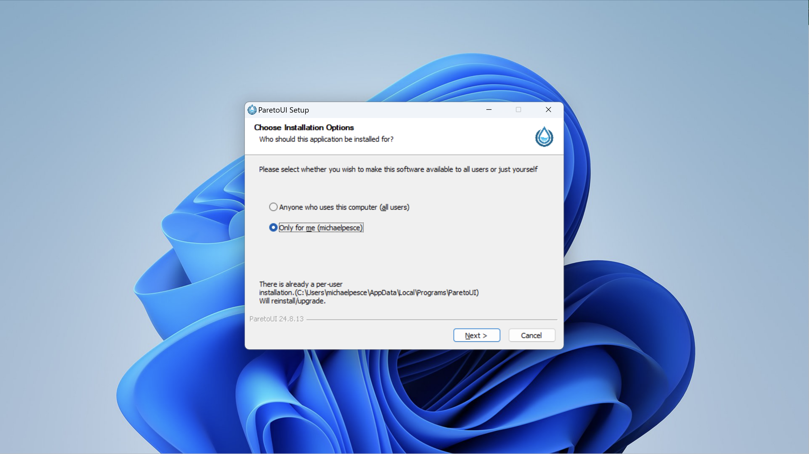
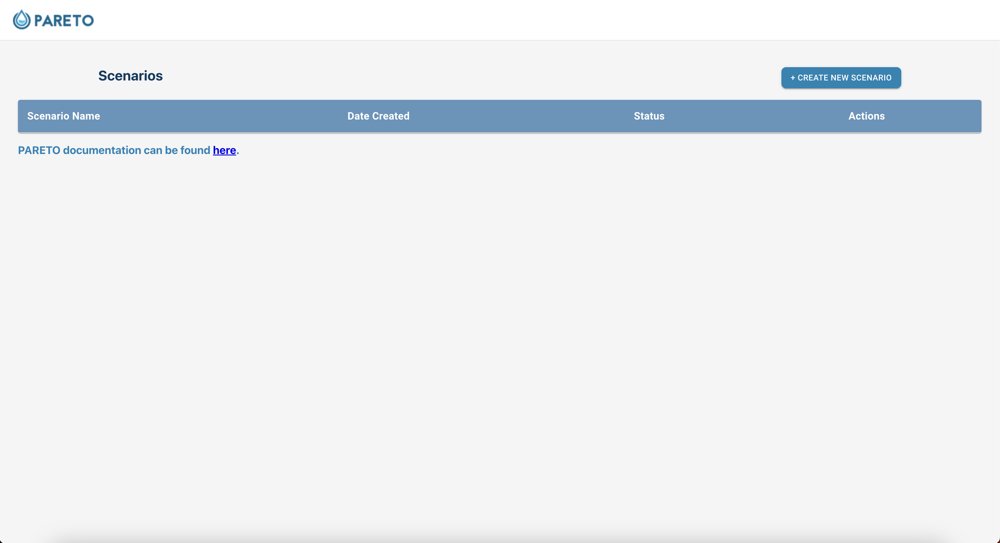
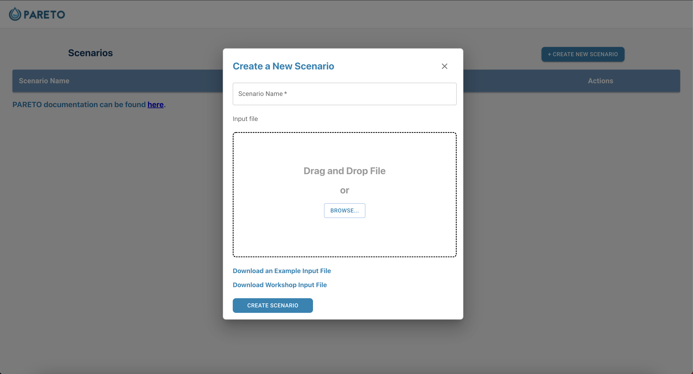
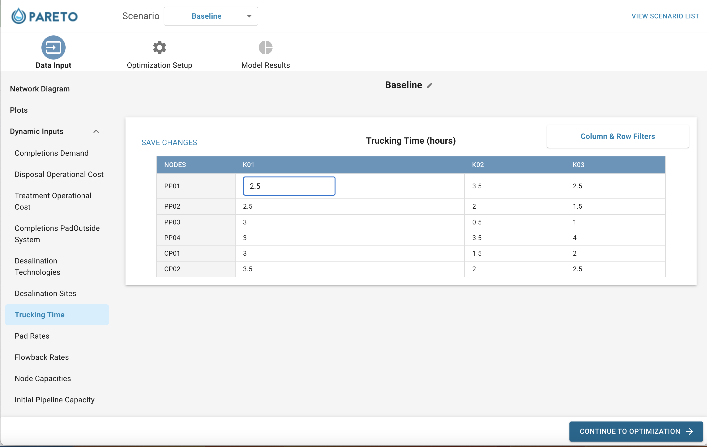
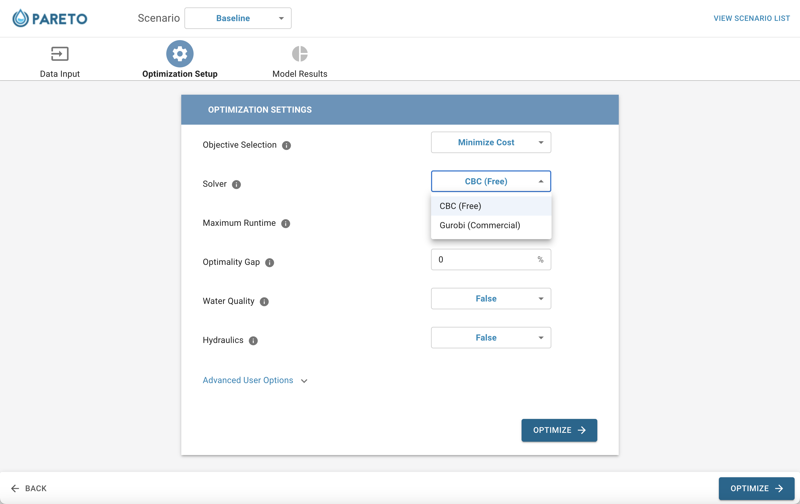
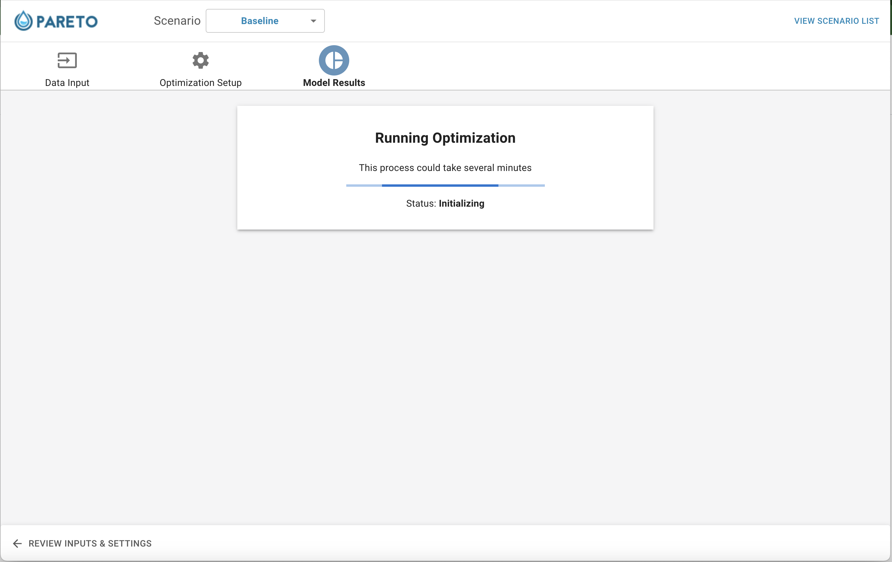
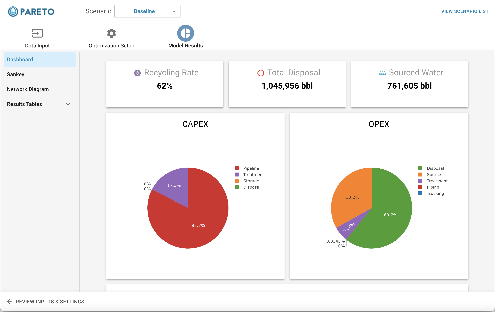
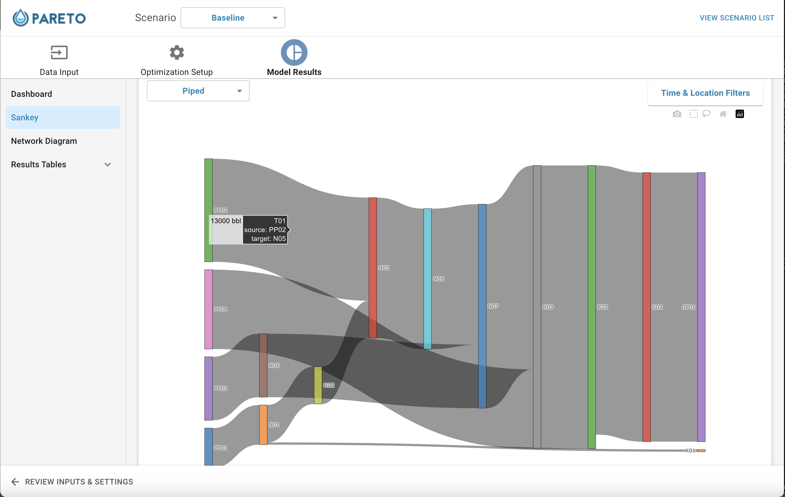
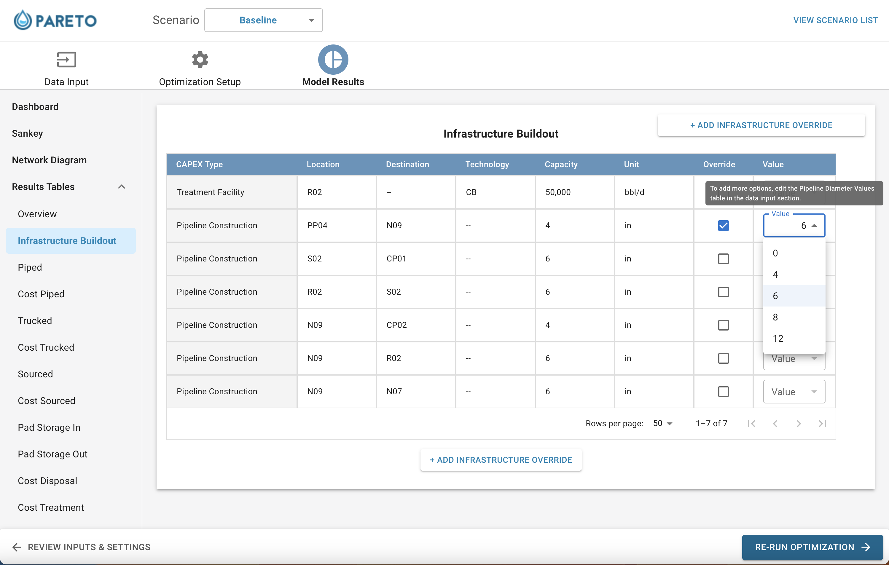
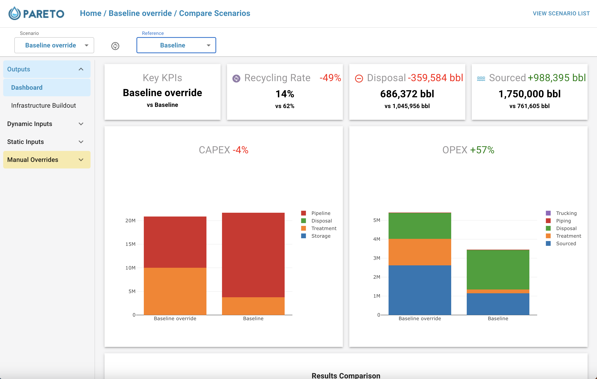
