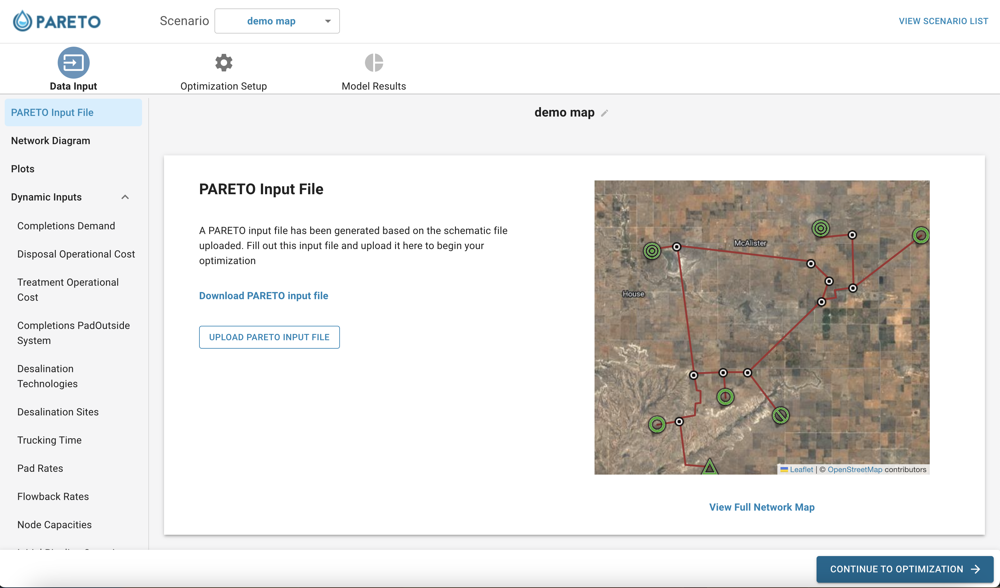
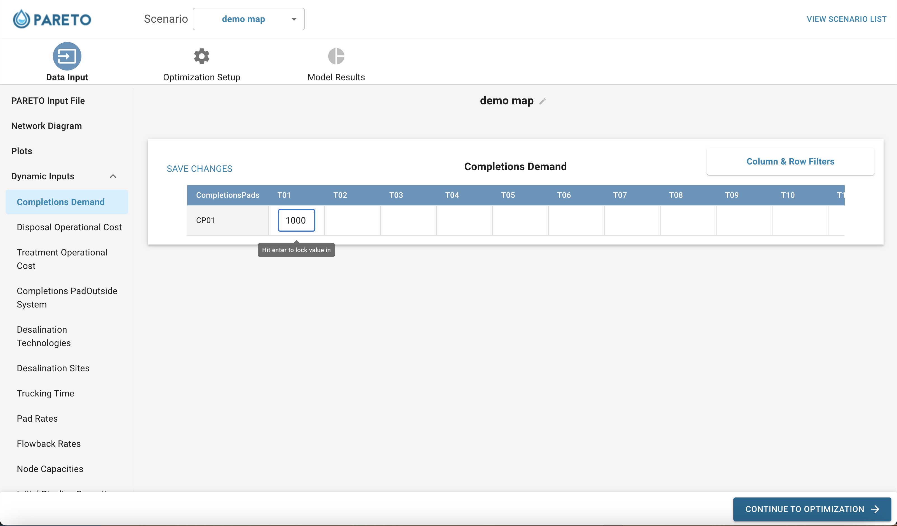

=========================
How To Use User Interface
=========================

.. _how-to-use-ui-page:

Step-by-step guide
------------------

.. container::

   .. container::

      .. container::

         **Step 1.** Download the latest version of PARETO for your
         operating system at the `Project PARETO Website <https://www.project-pareto.org/software>`_.

         .. container:: screenshot-div

            |software-website|

         **Step 2.** Follow the installation steps to install the
         application. For windows, see below:

         .. container:: screenshot-div

            |windows-installer|

         **Step 3.** Run the application, you should see a splash page
         before being redirected to the scenarios page:

         .. container:: screenshot-div
            
            |scenarios-page|

         **Step 4.** Click on "Create new scenario". Download from one
         of the available sample inputs, or use your own data, then name the scenario and click
         "Create scenario":

         .. container:: screenshot-div

            |create-scenario|

         **Step 5.** Browse the input plots and tables, with the option
         to edit any of the inputs:

         .. container:: screenshot-div

            |input-page|

         **Step 6.** Click the "optimization setup" button, and choose
         from our model settings. If you have a gurobi license, select
         "gurobi" from the solver options:

         .. container:: screenshot-div

            |model-settings|

         **Step 7.** Click "run model":

         .. container:: screenshot-div

            |running-model|

         **Step 8.** When the model is finished running, the KPI
         dashboard will be visible from the model results section:

         .. container:: screenshot-div

            |kpi-dashboard.|

         **Step 9.** Analyze the output by looking through tables and
         graphs, including the sankey diagram that interactively
         displays the distribution of produced water:

         .. container:: screenshot-div

            |sankey-diagram|

         **Step 10.** If you are unhappy with any of PARETO's
         infrastructure decisions, feel free to override with your own
         decisions in the "infrastructure buildout" tab:

         .. container:: screenshot-div

            |infrastructure-override|

         **Step 11.** Compare different scenarios by clicking on any of
         the compare icons from the scenario page:

         .. container:: screenshot-div

            |scenario-comparison|

.. _map_example:

Map Feature (Beta)
------------------

.. container::

   The UI team has implemented a method for users to interact with the UI by uploading a map file representing their network. 
   The UI can handle .kmz or .kml files as inputs.
   By using this feature, users can greatly reduce the amount of input data required to begin working with PARETO. However, this feature is still
   in its early phase so functionality is limited.

   .. container::

      **Step 1.** Navigate to the PARETO UI scenario list page. Click create scenario, and upload your map file. You will be directed to this input page:

      .. container:: screenshot-div

         |map-input|

      **Step 2.** Download the auto generated excel input file, fill in the forecasted data, and re-upload to continue with optimizing your scenario OR 
      fill the data in directly through the UI:

      .. container:: screenshot-div

         |edit-input-map|

         Once the scenario is ready to go, you can continue optimizing and interacting with the UI by following the steps above. 

.. |kpi-dashboard.| image:: ./img/kpi-dashboard.png
   :class: screenshot

.. |full-map| image:: ./img/full-map.png
   :class: screenshot

