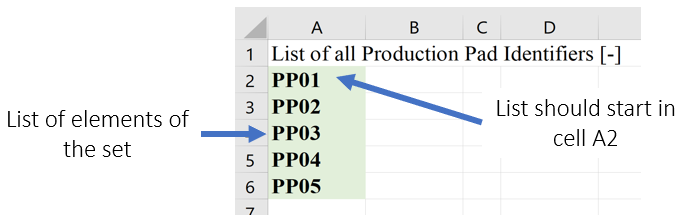
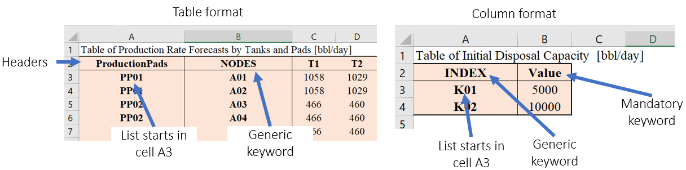

Get Data Functions
==================

The following functions are used to conveniently acquire data.

+----------------------+---------------------------------------+
| Function             | Section                               |
+======================+=======================================+
| get_data             | :ref:`get_data_get_data`              |
+----------------------+---------------------------------------+
| set_consistency_check| :ref:`get_data_set_consistency_check` |
+----------------------+---------------------------------------+
| od_matrix            | :ref:`get_data_od_matrix`             |
+----------------------+---------------------------------------+

.. _get_data_get_data:

Get Data
---------

**Method Description:**

This method uses Pandas methods to read data for sets and parameters from an
Excel spreadsheet. Sets are assumed to have neither a header nor an index column.
In addition, the data should be placed in column A, row 2, for example:

    
    Figure 1. get_data Set Setup Format
    

Parameters can be in either table or column format. Table format requires a header (usually time periods) and index columns whose elements should be contained in a set. Each index column should be labeled with a header starting in cell A2. Spreadsheet names for sets should be used as headers; however, generic keywords “NODES” and “INDEX” can also be used. Column format requires that each set be placed in one column, starting from cell A3. Spreadsheet names for sets should be used as headers in row 2 for each column “NODES” and “INDEX” can also be used. Data should be provided in the last column, and the keyword “VALUE” should be used as header.

    
    Figure 2. get_data Parameter Setup Format
    
    
This method outputs a dictionary that contains a list for each set
and a dictionary that contains parameters in the following format:
{‘param1’: {(set1, set2): value}, ‘param1’: {(set1, set2): value}}

**How to Use**::

 set_list = ['ProductionPads','CompletionsPads']
 parameter_list = ['DriveTimes', 'CompletionsDemand']
 fpath = 'path\\to\\excel\\file.xlsx’
 # Note: set_list and parameter_list are optional arguments to get_data. When not given, only tabs with valid PARETO input tab names will be read.
 [df_sets, df_parameters] = get_data(fpath, set_list, parameter_list)

.. note::
    Custom data tabs can optionally be passed to the function as shown above. If the custom data tabs include invalid PARETO input, the data is not incorporated into the PARETO model unless the models are modified.

.. _get_data_set_consistency_check:

Set Consistency Check
---------------------

**Method Description:**

This method checks if the elements included in a table or parameter have been defined as part of the
Sets that index such parameter. set_consistency_check() raises a TypeError exception If there are entries in the Parameter that are not
contained in the Sets, and prints out a list with all the entries that require revision.

**How to Use:**

The method requires one specified parameter (e.g. ProductionRates) AND one OR several sets over which
the aforementioned parameter is declared (e.g.ProductionPads, ProductionTanks, TimePeriods). In general,
the method can be run as follows: set_consistency_check(Parameter, set_1, set_2, etc)

.. _get_data_od_matrix:

Origin/Destination Matrix
-------------------------

**Method Description:**

This method allows the user to request drive distances and drive times using Bing maps API and
Open Street Maps API.
The method accept the following input arguments:
- origin:
    
    REQUIRED. Data containing information regarding location name, and coordinates
    latitude and longitude. Two formats are acceptable:

    * {(origin1,"latitude"): value1, (origin1,"longitude"): value2} or
    * {origin1:{"latitude":value1, "longitude":value2}}

    The first format allows the user to include a tab with the corresponding data
    in a table format as part of the workbook casestudy.

- destination:
    OPTIONAL. If no data for destination is provided, it is assumed that the
    origins are also destinations.

- api:  
    OPTIONAL. Specify the type of API service, two options are supported:

    * Bing maps: https://docs.microsoft.com/en-us/bingmaps/rest-services/
    * Open Street Maps: https://www.openstreetmap.org/

    If no API is selected, Open Street Maps is used by default

- api_key:  
    An API key should be provided in order to use Bing maps. The key can be obtained at:
    https://www.microsoft.com/en-us/maps/create-a-bing-maps-key

- output:   
    OPTIONAL. Define the parameters that the method will output. The user can select:
    
    * 'time': A list containing the drive times between the locations is returned
    * 'distance': A list containing the drive distances between the locations is returned
    * 'time_distance': Two lists containing the drive times and drive distances between the locations is returned

    If not output is specified, 'time_distance' is the default

- fpath:    
    OPTIONAL. od_matrix() will ALWAYS output an Excel workbook with two tabs, one that
    contains drive times, and another that contains drive distances. If not path is
    specified, the excel file is saved with the name 'od_output.xlsx' in the current
    directory.

- create_report:
    OPTIONAL. if True an Excel report with drive distances and drive times is created

