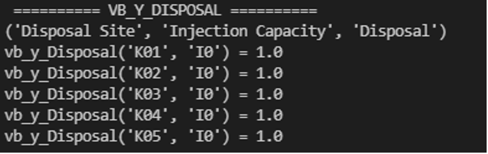
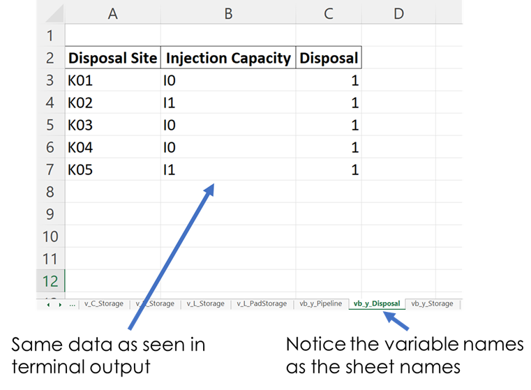
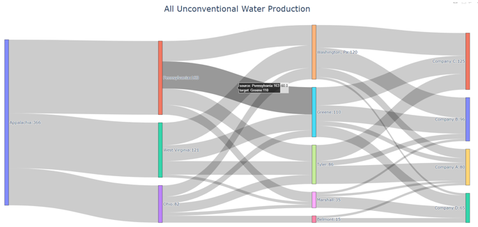
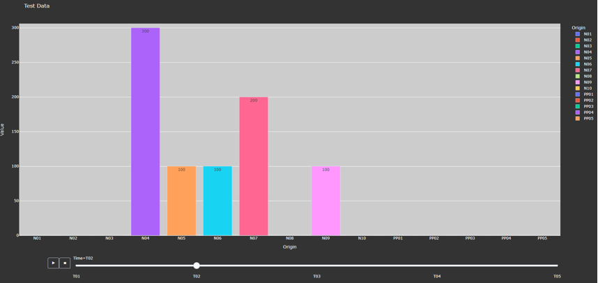
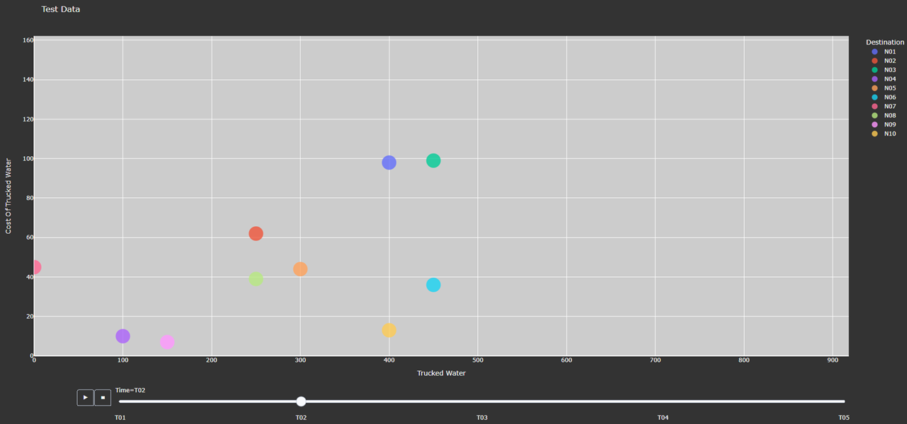
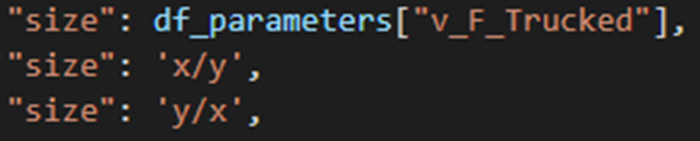
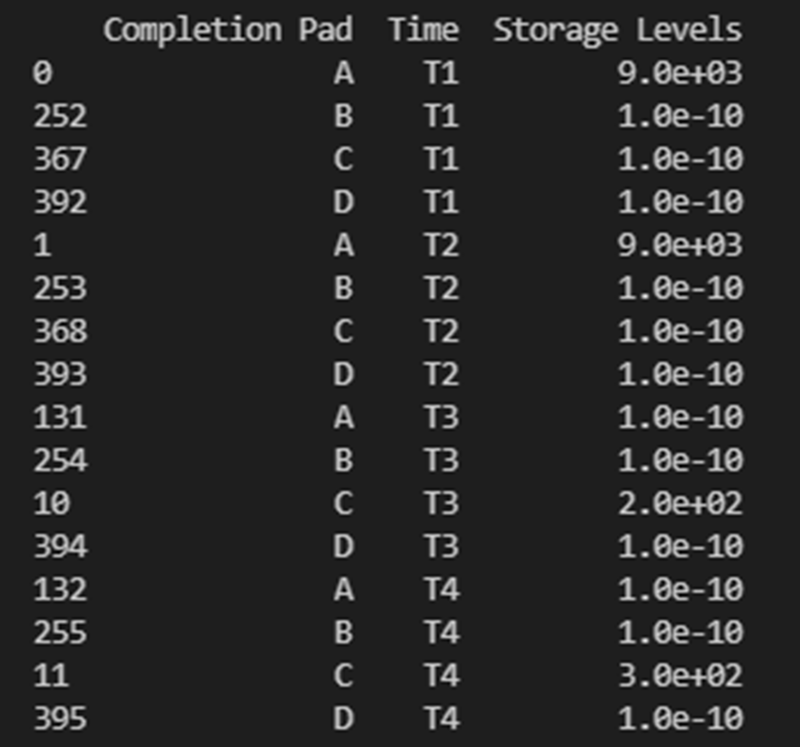

Results Functions
=================

The following functions are used to conveniently display and analyze data.

+----------------------+---------------------------------------+
| Function             | Section                               |
+======================+=======================================+
| generate_report      | :ref:`results_generate_report`        |
+----------------------+---------------------------------------+
| generate_sankey      | :ref:`results_generate_sankey`        |
+----------------------+---------------------------------------+
| plot_sankey          | :ref:`results_plot_sankey`            |
+----------------------+---------------------------------------+
| plot_bars            | :ref:`results_plot_bars`              |
+----------------------+---------------------------------------+
| plot_scatter         | :ref:`results_plot_scatter`           |
+----------------------+---------------------------------------+

.. _results_generate_report:

Generate Report
---------------

**Method Description:**

This method identifies the type of model: [strategic, operational], creates a printing list based on is_print,
and creates a dictionary that contains headers for all the variables that will be included in an Excel report.
The dictionaries are used to create separate excel sheets which categorize the data by variable name or type.
This same data is put into excel sheets named after each variable as well as an overview sheet which contains totals and Key Performance Indicators (KPI) information.

.. warning::
    If an indexed variable is added or removed from a model, the printing lists and headers should be updated
    accordingly. 

The output of this method prints out each variable’s information in the terminal as specified by the user, as shown below.

    Figure 1. Example of Terminal Output

    Figure 2. Example of Excel Output

**How to Use:**

This method requires two parameters:

1.) The model that is being returned from the create_model() method after a solution is found

2.) An array of an “enum” class value specifying which variables to print which are chosen by the user. These values are:

    *"PrintValues.Essential"* – Specifies that the overview information will be printed

    *"PrintValues.Nominal"* – Specifies that all information from PrintValues.Essential + Trucked, Piped, and Sourced water information will be printed

    *"PrintValues.Detailed"* – Specifies that all information including slack information will be printed
    

Example of how this method is used::

 strategic_model = create_model(df_sets, df_parameters)
 results = opt.solve(strategic_model, tee=True)
 [model, results] = generate_report(strategic_model, is_print=[PrintValues.Detailed], fname="..\\..\\PARETO_report.xlsx")

.. _results_generate_sankey:

Generate Sankey
---------------

**Method Description:**

Sankey diagrams are a graphic tool used to easily visualize supply-sink flows across a given infrastructure (source/destination).
The relative width of each "flow" is proportional to the amount of water that is being transported between locations.
Such diagrams are commonly used to visualize the complex nature of money, energy or material flows.

This method receives the final lists for source, destination, value, and labels to be used
in generating the Sankey diagram. It also receives arguments that determine font size and
plot titles. The user can save the Sankey diagram in the following formats: jpg, jpeg, pd, png, svg, and html. Html format is set by default.

**How to Use**::

  # Creating links and nodes based on the passed in lists to be used as the data for generating the Sankey diagram
    link = dict(source=source, target=destination, value=value)
    node = dict(label=label, pad=30, thickness=15, line=dict(color="black", width=0.5))
    data = go.Sankey(link=link, node=node)

    # Assigning sankey diagram to fig variable
    fig = go.Figure(data)
    fig.write_html("first_figure.html", auto_open=True)

.. _results_plot_sankey:

Plot Sankey
-----------

**Method Description:**

This method receives data in the form of 3 seperate lists (origin, destination, value lists), generate_report dictionary
output format, or get_data dictionary output format. It then places this data into 4 lists of unique elements so that
proper indexes can be assigned for each list so that the elements will correspond with each other based off of the indexes.
These lists are then passed into the outlet_flow method which gives an output which is passed into the method to generate the
sankey diagram.

    Figure 3. Example of Sankey Diagram Showing Water Production Flows

**How to Use:**

This method requires two parameters:

1.) An input data dictionary that includes the time periods requested as well as said data. The data is passed in as ‘pareto_var’ and can be in get_data() format, which requires labels, generate_report() format, or 3 separate lists:

    *"pareto_var"* – This parameter can be variable data returned from the get_data() or generate_report() format

    *"time_period"* – This is used to specify which time periods from the data that the user wants shown in the diagram. If the user passes no time periods in, then all time periods are used in the data.

    *"labels"* – This is only required if the data being passed in is in get_data() format. The labels are used to distinguish between the columns.

2.) A dictionary of arguments that include formatting options like font size, title of the plot and output file:

    *output_file* – This parameter is used for creating the file that contains the Sankey Diagram created by this method

Example of how this method is used::

 args = {"font_size": 15,
        "plot_title": "Completion Storage",
        "output_file": "..\\first_sankey.png"}

 input_data = {"pareto_var": df_parameters["v_f_Trucked"]
                "labels": [("Origin", "Destination", "Time", "Trucked Water")]}

 plot_sankey(input_data, args)

.. _results_plot_bars :

Plot Bars
---------

**Method Description:**

This method generates a bar chart based on the variable data that the user passes in. It automatically creates either an animated bar chart (if the variable is indexed by time) or a static bar chart.

    Figure 4. Animated Bar Chart

**How to Use**

This method requires two parameters:

1.) A dictionary including the data and labels that are being used, either in get_data() output format or generate_report() output format. (Labels only required for get_data() format).

    *"pareto_var"*– This parameter contains the data that the user wants to use

    *"labels"*– This is a tuple that contains the labels for each column of the data provided.

2.) A dictionary of arguments that include the title of the plot, a group by parameter, and an output file. Here is an example of the arguments:

    *"group_by"* - This specifies what field will be used as the x axis in the plot

    *"output_file"* - This parameter is used for creating the file that contains the Bar Chart created by this method.

    *"y_axis"* - This specifies if the user wants to take the logarithm of the y axis. If not provided, then the y axis remains the default(linear).

Example of how this method is used::

  args = {"plot_title": "Completion Storage",
            "y_axis": "log",
            "group_by": "Destination",
            "output_file": "first_bar.html"}

  input_data = {"pareto_var": df_parameters["v_f_PadStorage"]
                "labels": [("Completion Pad", "Time", "Storage Levels")]}

  plot_bars(input_data, args)

.. _results_plot_scatter:

Plot Scatter
---------

**Method Description:**

This method creates the scatter plot that is generated from the variable data that the user passes in. It creates either an animated scatter plot(if the variable is indexed by time) or a static scatter plot.

    Figure 5. Animated Scatter Chart. Notice the time period slider at the bottom.

**How to Use**

This method requires two parameters:

1.) An input data dictionary that include the variables for x and y axis, a size parameter, and labels parameters that provides a tuple of labels (only required for get_data() format) for x, y, and size variables.

    *"pareto_var"*– This parameter contains the data that the user wants to use.

    *"labels"*– This is a tuple that contains the labels for each column of the data provided.

    *"size"*- This specifies what will be used for the size of each individual marker on the plot. If the size parameter is not provided, a default size is given to all the markers. There are 3 options for the size parameter:
        - "x/y" - This specifies that size will be calculated as a ratio of the x variable data over the y variable data
        - "y/x" - This specifies that size will be calculated as a ratio of the y variable data over the x variable data
        - A Pareto variable that contains data for the size of the bubbles. The data must match the column used for grouping the data in the option "group_by".

    Figure 6. Options for specifying the bubbles size.

2.) A dictionary of arguments that include the title of the plot, a group by parameter, and an output file. Here is an example of the arguments:

    *"group_by"* - This specifies what field will be used as the x axis in the plot. The column name should be used to indicate how to group the data.
    If "group_by" is not specified, then first column is used.

    *"output_file"* - This parameter is used to name a file that the figure will be output to. It can be a file path such as “..\\first_figure.html” or just the file name itself “first_figure.html”.
    There will always need to be a specified extension to the file. The accepted file extensions are as follows: .html, .png, .jpg, .jpeg, .svg, .pdf

    *"print_data"* - The PARETO methods allow the user to specify if they want the plotted data to be printed in the console (default is False):
        - True: The dataframe used for creating the figure is printed in the console

    Figure 7. Setting print_data to True will print out a dataframe for easy inspection.

    *"group_by_category"* - This specifies how the color of the nodes will be assigned for easy visualization. There are 3 options:
        - True: This will cause the color of the chart markers to be grouped based on the names of the nodes. For example: PP, CP, N, R, S, K, etc 
        will be assigned a unique color.

        - False: The data won't be categorized by color, therefore one color will be used for the chart markers.

        - A Pareto variable containing a custom categorization. The method will recognize the variable automatically and the values in this variable 
        will be used for assigning colors to the categories that are provided. An excel sheet should be created with all Node names, removing all duplicates,
        and assigning a numerical value to each specific node with the category the user would like it to be associated with. This approach is best for 
        the situations where nodes of different types are to be categorized together.

.. figure:: plot_scatter_3.png
    :width: 800
    :align: center

    Figure 8. Data used for custom categories.

Example of how this method can be used::

  args = {"plot_title": "Trucked Water",
            "y_axis": "log",
            "group_by": "Origin",
            "output_file": "first_bar.html",
            "print_data": True,
            "group_by_category": df_parameters["plot_scatter_categories"]}

  input_data = {"pareto_var_x": df_parameters["plot_scatter_vFPiped"],
                "pareto_var_y": df_parameters["plot_scatter_vCPiped"],
                "size": df_parameters["plot_scatter_vSize"], # 'x/y', 'y/x'
                "labels_x": [("Origin", "Destination", "Time", "Trucked Water")],
                "labels_y": [("Origin", "Destination", "Time", "Cost of Trucked Water")],
                "labels_size": [("Origin", "Destination", "Time", "Size")],
                }

  plot_scatter(input_data, args)