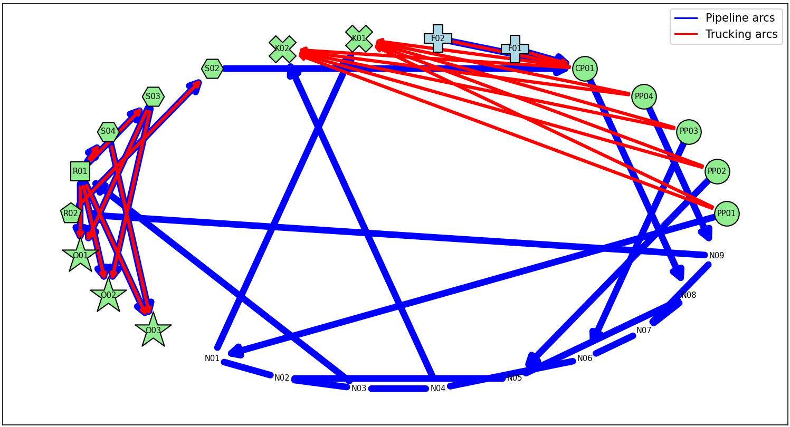
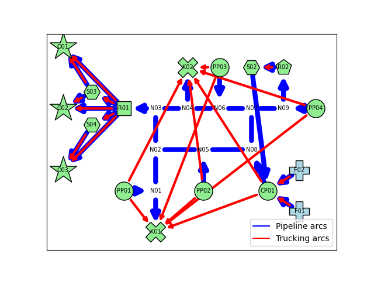

Visualization Feature
======================

This feature utilizes the `networkx` library to create a graphical visualization of the network model. The method extracts nodes and edges from the model to generate a visual representation, allowing for an intuitive understanding of the network's structure.

Usage Instructions
------------------

To use this feature, first build the model and then call the visualization method as shown below::

    plot_network(model)

You can customize the visualization by adjusting the argument values as needed. For example, to display both piping and trucking arcs, you can use::

    plot_network(model, show_piping=True, show_trucking=True)

A complete list of the optional keyword arguments for `plot_network()` follows:

- ``show_piping``: (``bool``, default = ``True``)
    Determines whether to display available pipeline arcs within the network.

- ``show_trucking``: (``bool``, default = ``False``)
    Determines whether to display available trucking arcs within the network.

- ``show_results``: (``bool``, default = ``False``)
    If ``True``, the network visualization will highlight the pipelines which are suggested to be built or expanded. The model needs to be in a solved state for this option to have an effect.

- ``save_fig``: (``str``, default = ``None``)
    Specifies the file name for saving the visualization. No figure is saved if a file name is not provided.

- ``show_fig``: (``bool``, default = ``True``)
    If ``True``, the network visualization will be displayed directly after creation.

- ``pos``: (``dict``, optional)
    A dictionary to define the relative positions of the nodes in the format ``{Node: (x, y)}``. For example: ``{R01: (10,10)}``. If this dictionary is not provided, the network elements are displayed in a circular layout.

Examples
--------

The following figures show the network visualization produced for the strategic toy case study, showing both piping and trucking arcs, first with the default circular layout, and second in a layout with custom positioning:

