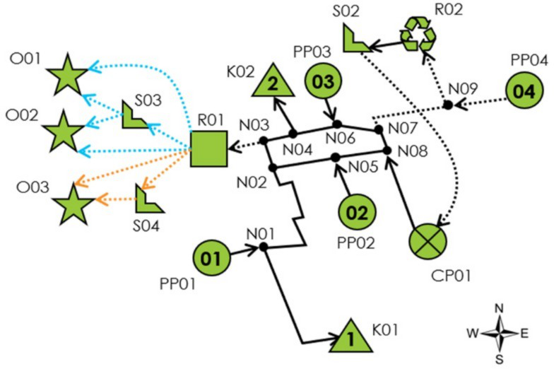

Visualization Feature
======================

This feature utilizes the `networkx` library to create a graphical visualization of the network model. The method extracts nodes and edges from the model to generate a visual representation, allowing for an intuitive understanding of the network's structure and flow.

Customization Options
----------------------

The method includes several arguments to enhance the visualization, making it more adaptable to specific needs:

- **show_piping**: (`bool`, default=True) 
  Determines whether to display piping arcs within the network.
  
- **show_trucking**: (`bool`, default=True) 
  Controls the visibility of trucking arcs.
  
- **show_results**: (`bool`, default=False) 
  If set to True, the network will display the computed results alongside the visual elements.
  
- **save_fig**: (`str`, default="network.png") 
  Specifies the filename for saving the visualization as a PNG image.
  
- **show_fig**: (`bool`, default=False) 
  If True, the network visualization will be displayed directly after creation.
  
- **pos**: (`dict`, optional) 
  A dictionary to define the relative positions of the nodes in the format `{Node: (x, y)}`. For example: `{R01: (10,10),}`.

.. image:: network.png
   :alt: Network visualization with specified positions

Default Layout
--------------

By default, the network is displayed in a circular layout. This provides a clear and balanced overview of the entire network.

.. image:: network_circular.png
   :alt: Network visualization in a circular layout

Usage Instructions
------------------

To use this feature, first build the model and then call the visualization method as shown below::

    plot_network(model)

You can customize the visualization by adjusting the argument values as needed. For example, to display the piping arcs but hide the trucking arcs, you would use:

    plot_network(model, show_trucking=False)

By adjusting these parameters, you can tailor the visualization to meet the specific requirements of your analysis.
